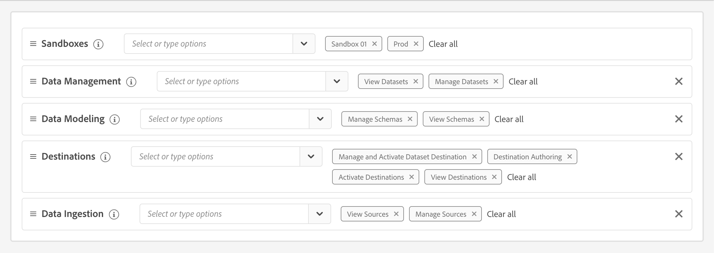

# 管理

使用 [Adobe Admin Console](https://helpx.adobe.com/tw/enterprise/using/admin-console.html) 管理Adobe Mix Modeler產品和使用者。

若要讓Adobe Mix Modeler正常運作，您必須設定正確的許可權。

在Adobe Experience Cloud UI、

1. 選取 **[!UICONTROL Permissions]** 從左側邊欄底下 **[!UICONTROL ADMINISTRATION]**.

1. 選取  **[!UICONTROL Roles]** 從左側面板。

1. 選取現有角色，或使用以下方式建立角色 **[!UICONTROL Create role]**. 如果您選取了現有的角色，請選取  **[!UICONTROL Edit]** 編輯角色的許可權。 另請參閱 [管理角色](https://helpx.adobe.com/tw/enterprise/using/admin-console.html) 以取得詳細資訊。

1. 請確定您為角色選取下列許可權：

   * **[!UICONTROL Sandboxes]**：至少選取一個沙箱。

   * **[!UICONTROL Data Management]**：請務必選取選項 **[!UICONTROL View Datasets]** 和 **[!UICONTROL Manage Datasets]**.

   * **[!UICONTROL Data Modeling]**：請務必選取選項 **[!UICONTROL Manage Schemas]** 和 **[!UICONTROL View Schemas]**.

   * **[!UICONTROL Destinations]**：請務必選取 **[!UICONTROL Manage and Activate Dataset Destination]**， **[!UICONTROL Destination Authoring]**， **[!UICONTROL Activate Destinations]** 和 **[!UICONTROL View Destinations]**.

   * **[!UICONTROL Data Ingestion]**：請務必選取 **[!UICONTROL View Sources]** 和 **[!UICONTROL Manage Sources]**.

   為角色設定的許可權應如下所示：

   

   選取 **[!UICONTROL Save]** 以儲存許可權。

1. 在 **[!UICONTROL Details]** 範圍 **[!UICONTROL Role]**，新增適當的 **[!UICONTROL Users]** 和/或 **[!UICONTROL User groups]** 提供使用者存取Adobe Mix Modeler的許可權。
