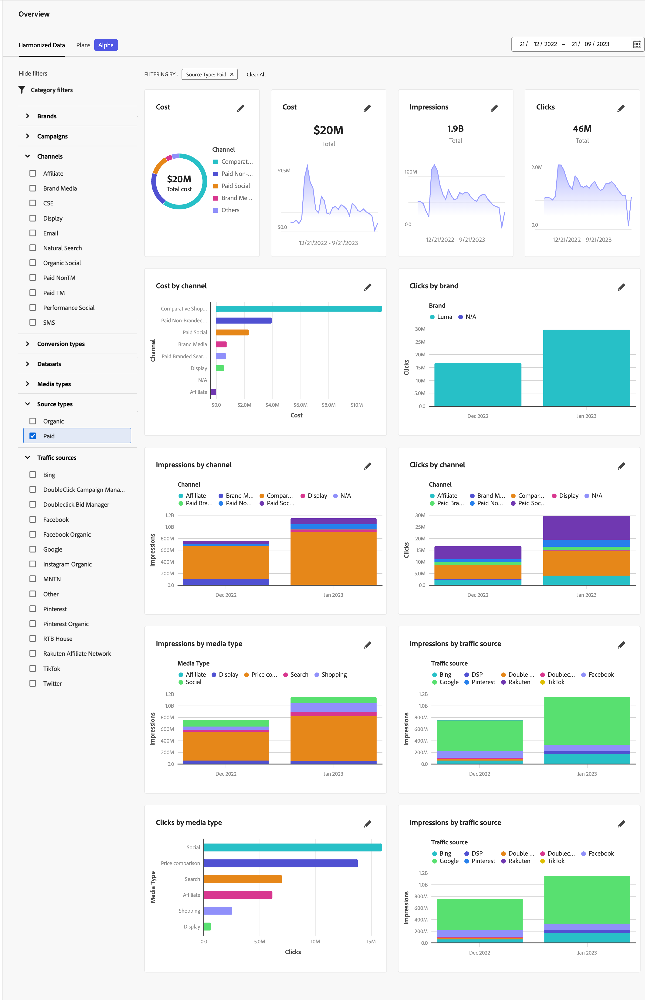
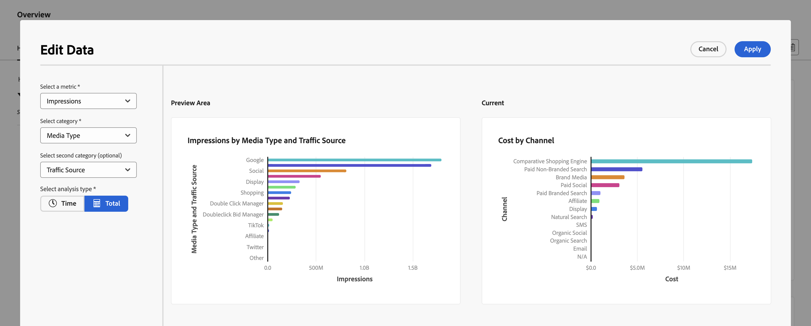

# 協調的資料概觀

「Adobe組合建模器概覽」中的「協調資料」索引標籤可讓您深入瞭解已設定為用於內嵌資料和協調資料設定一部分的協調資料。

此概覽會顯示四個KPI狀態卡介面工具集（最上方列）和六個其他可設定的Widget。

若要變更Widget中顯示資料的日期期間，請手動輸入開始日期和結束日期，或使用以下方式選取期間 .

## 資料篩選器

您可以使用  **[!UICONTROL Data Filters]** 窗格。

為每個類別選取一或多個篩選器(**[!UICONTROL Channel]**， **[!UICONTROL Brand]**， **[!UICONTROL Source Type]**、和 **[!UICONTROL Traffic Source]**)。

選取的篩選器會顯示在Widget上方 **[!UICONTROL FILTERING BY:]**.

1. 若要移除個別篩選器，請選取  在篩選器上，列於 **[!UICONTROL FILTERING BY:]**.

1. 您可以使用以下快速清除所有篩選器 **[!UICONTROL Clear All]**.

## 設定Widget

您可以設定每個Widget。

* 在KPI狀態卡介面工具上：

   1. 選取  和  **[!UICONTROL Edit Data]** 從內容功能表。

   1. 在 **[!UICONTROL KPI status card]** 對話方塊：

      1. 選取 **[!UICONTROL KPI]** 從清單中。

      1. 選取 **[!UICONTROL Apply]** 將變更套用至卡片。 選取 **[!UICONTROL Cancel]** 以取消變更。

* 在其他可設定的Widget上：

   1. 選取  和  **[!UICONTROL Edit Data]** 從內容功能表。

   1. 在 **[!UICONTROL Edit Data]** 對話方塊：

      1. 選取量度來源 **[!UICONTROL Select a metric]**，例如 **[!UICONTROL Impressions]**.
      1. 選取類別，從 **[!UICONTROL Select category]**，例如 **[!UICONTROL Media Type]**.
      1. （選擇性）從中選擇第二個類別 **[!UICONTROL Select second category (optional)]**，例如 **[!UICONTROL Traffic Source]**.
      1. 選取  **[!UICONTROL Time]** 或  **[!UICONTROL Total]** 作為分析型別 **[!UICONTROL Select analysis type]**.

         如果您選取  **[!UICONTROL Time]**，您可以指定時間頻率。 選取 **[!UICONTROL Daily]**， **[!UICONTROL Weekly]**， **[!UICONTROL Monthly]** 或 **[!UICONTROL Quarterly]** 從 **[!UICONTROL Select time frequency]**.

         您會在以下連結中看到目前選取範圍的更新預覽： [!UICONTROL Preview Area] 以及您目前的Widget [!UICONTROL Current].

         

         如果由於資料不可用而無法呈現預覽，您會看到  [!UICONTROL Insights Not Available] - [!UICONTROL Harmonized fields are not available].

      1. 選取 **[!UICONTROL Apply]** 將變更套用至Widget。 選取 **[!UICONTROL Cancel]** 以取消對目前Widget所做的任何變更。

