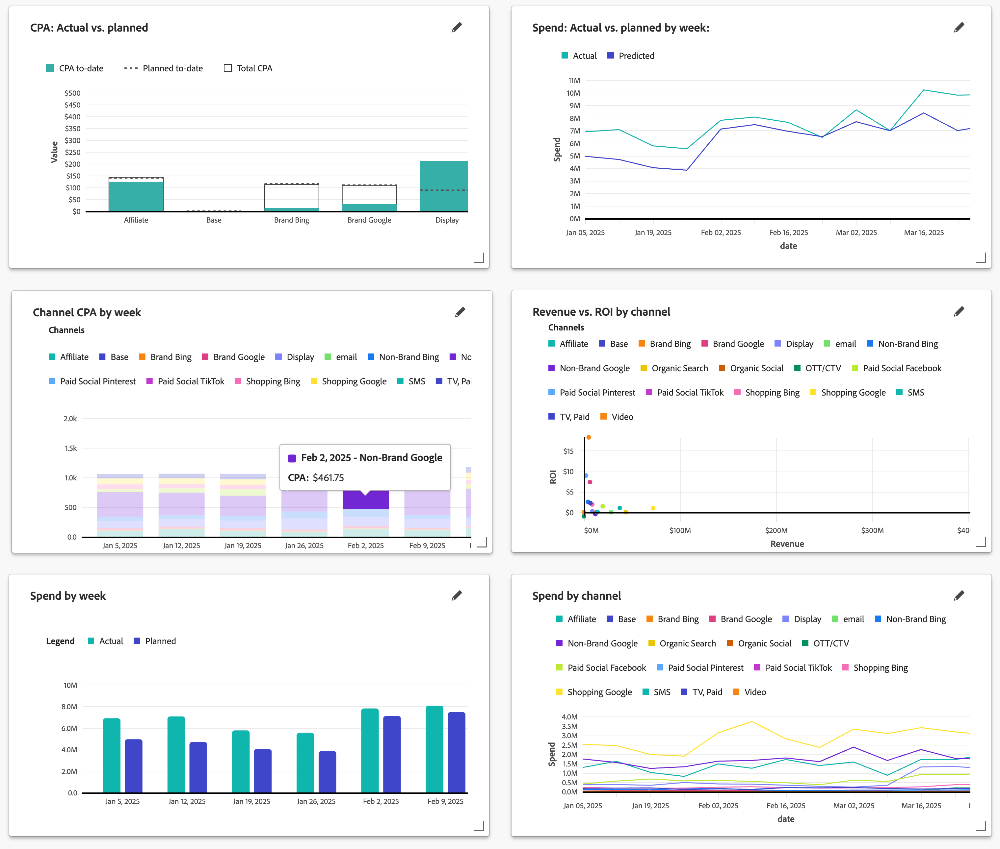

# 計畫績效

>[!NOTE]
>
>Mix Modeler **[!UICONTROL Performance to plan]**&#x200B;首頁[!BADGE  ]{type=Informative}中的Beta **[!UICONTROL Overview]**&#x200B;索引標籤是測試版功能，其功能可能會有所變更。 此功能僅供有限數量的客戶使用。

Mix Modeler **[!UICONTROL Plans]**&#x200B;首頁[!BADGE  ]{type=Informative}中的Beta **[!UICONTROL Overview]**&#x200B;索引標籤提供追蹤儀表板，可監視行銷針對計畫的執行成效。 您可以透過狀態卡和視覺效果追蹤實際績效與計畫績效。

儀表板可協助您識別差距、發現風險或機會，並及時調整您的計畫和預算。

若要選取要針對KPI狀態卡和視覺效果顯示哪些資料：

* 從&#x200B;**[!UICONTROL Plan name]**&#x200B;下拉式功能表中使用&#x200B;**[!UICONTROL _選取選項……_]**&#x200B;來選取計畫。

* 指定日期期間。 若要變更日期期間，請手動輸入開始日期和結束日期，或使用選取日期期間。

**[!UICONTROL Plans]** [!BADGE Beta]{type=Informative}索引標籤顯示：

* [KPI狀態卡](#kpi-status-cards)：

   * [預算](#budget)
   * [收入](#revenue)
   * [ROI](#roi)
   * [KPI](#kpi)

* [視覺效果](#visualizations)：
   * [*量度*](#metric-actual-vs-planned)
   * [*量度*](#metric-actual-vs-planned-by-granularity)
   * [Channel ](#channel-metric-by-granularity)
   * [*量度*](#metric-vs-metric-by-channel)
   * [*量度*](#metric-by-granularity)
   * [*量度*](#metric-by-channel)

## KPI狀態卡

### 預算

循環進度視覺效果，顯示行銷支出與日期期間計畫預算的比較結果。

### 收入

循環進度視覺效果，顯示實際收入與日期期間計畫目標收入的比較結果。

### ROI

顯示日期期間ROI的線條圖視覺效果。

### KPI

顯示日期期間KPI的線條視覺效果。

若要選取其他KPI：

1. 選取。
1. 在&#x200B;**[!UICONTROL KPI status card]**&#x200B;對話方塊中，從&#x200B;**[!UICONTROL KPI]**&#x200B;下拉式功能表中選取KPI。 可用的選項包括： [!UICONTROL Conversions]、[!UICONTROL CPA]、[!UICONTROL Revenue]、[!UICONTROL ROI]和[!UICONTROL Spend]。

## 視覺效果

您有六種視覺效果可供使用，並可編輯這六種視覺效果中的每一種。

若要調整視覺效果大小，請使用右下角的┛控制代碼。 若要移動視覺效果，只需將視覺效果拖放至偏好位置。

您可以將滑鼠停留在視覺效果中的任何線條、橫條圖或散佈元素上，以顯示包含其他資訊的快顯視窗。

### *量度*：實際與計畫

棧疊長條圖視覺效果會比較迄今、規劃至今和總計選取的量度值。

### *量度*：實際與計畫的&#x200B;*粒度*

折線圖視覺效果可顯示所選量度和所選粒度的實際值和計畫值。

### 管道&#x200B;*量度* x *粒度*

一種棧疊長條圖視覺效果，可顯示顯示所選量度和所選詳細程度的管道的棧疊長條。

### *量度*&#x200B;與&#x200B;*量度*&#x200B;的比較（依管道）

散佈圖視覺效果可顯示所選量度中的管道散佈圖。

### *量度* x *粒度*

顯示所選量度之實際和計畫值的長條圖視覺效果。

### *量度* （依管道）

多折線圖視覺效果可顯示所選量度在所選粒度上的變化。

### 編輯視覺效果

若要編輯視覺效果：

1. 選取以開啟&#x200B;**[!UICONTROL Edit data]**&#x200B;對話方塊。
1. 您可以根據視覺效果變更：

   * 一或兩個量度：從&#x200B;**[!UICONTROL Select metric]**&#x200B;下拉式選單中選取量度。

      * 對於以ROI為基礎的計畫，選項包括： [!UICONTROL Conversions]、[!UICONTROL CPA]、[!UICONTROL Revenue]、[!UICONTROL ROI]、[!UICONTROL Spend]和[!UICONTROL Volume]。
      * 對於以CPA為基礎的計畫，選項為： [!UICONTROL Conversions]、[!UICONTROL CPA]、[!UICONTROL Spend]和[!UICONTROL Volume]。
   * **[!UICONTROL Granularity]**：從&#x200B;**[!UICONTROL date ranges]**&#x200B;下拉式功能表中選取&#x200B;**[!UICONTROL week]**&#x200B;或&#x200B;**[!UICONTROL Granularity]**。

   您在&#x200B;**[!UICONTROL Preview]**&#x200B;中看到變更與&#x200B;**[!UICONTROL Current]**&#x200B;視覺效果有何不同。

1. 選取&#x200B;**[!UICONTROL Apply]**&#x200B;以套用變更。 選取&#x200B;**[!UICONTROL Cancel]**&#x200B;以取消視覺效果的任何變更。
