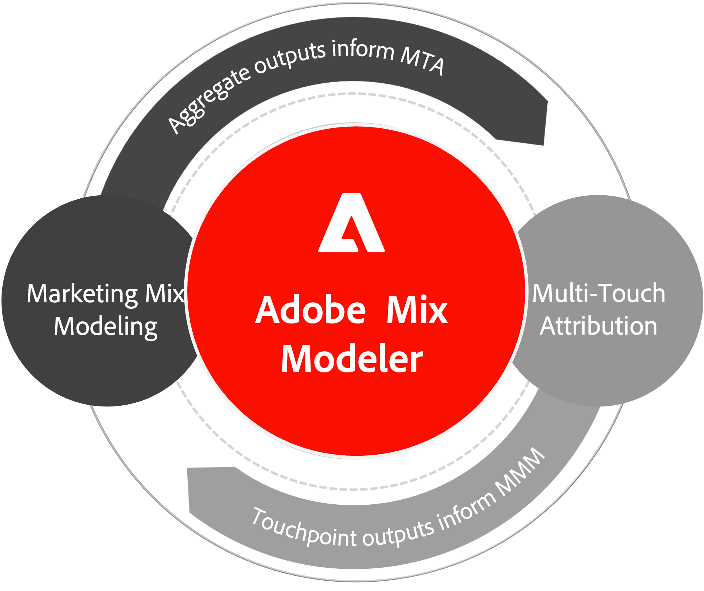

# Adobe組合建模器概覽

Adobe Mix Modeler採用Adobe Sensei技術，可讓行銷人員評估行銷活動，並跨越所有管道（付費、贏取和擁有）全面最佳化規劃。 其統一的方法論會以漸進方式在行銷接觸點和彙總層級進行測量，同時確保完全一致的結果。

Adobe組合建模器透過全方位（端對端）測量應用程式，用於數位和離線行銷，提供所有行銷活動對業務和行銷活動結果的累加影響。

「Adobe組合塑模工具」在策略與戰術層面提供下列最佳化且可操作的深入分析型別，讓您更易瞭解：

* 跨各種管道的行銷支出和產生的效能，以及
* 達成未來業務目標的建議投資水準。

為了完成此功能，Adobe組合建模器結合了：

* 由下而上（事件層級）資料和由上而下（彙總層級）資料，
* 外部市場因素與內部因素，以及
* 預測性和轉移機器學習方法。

AI/ML雙向傳輸學習會整合行銷組合建模(MMM)和多點接觸歸因(MTA)結果，以在無Cookie的世界中，確保測量和規劃的結果一致。

{width="500" align="center"}

## 功能

Adobe Mix Modeler提供下列功能：

| 功能 | 說明 |
|---|---|
| **測量遞增效能** | 瞭解跨業務目標或戰術行銷目標的遞增ROI和行銷影響。 |
| **跨MMM和MTA統一結果** | 透過轉移學習統一MMM和MTA模型，做出更有信心的決策。 |
| **以最佳方式分配預算** | 根據行銷支出和對目標的影響，識別最佳預算分配。 |
| **建立和比較預算案例** | 開發多種預算計畫並比較其影響，為您的企業做出最佳決策。 |

{style="table-layout:auto"}

