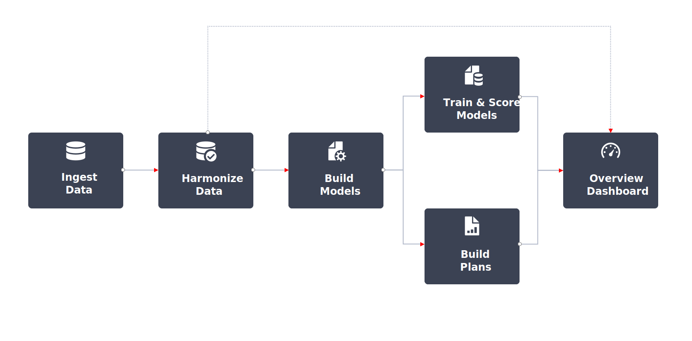

# Adobe組合建模器工作流程

「Adobe混合塑模工具」中的典型工作流程如下所示：

|  | 活動 | 說明 |
|---|---|---|
| {width="100"} | [**擷取資料**](../ingest-data/overview.md) | 從Adobe Experience Platform (例如Adobe Analytics、Web SDK、其他來源)擷取事件資料、來自行銷管道的彙總資料（例如電視、圍牆花園、電子郵件、擁有和經營活動）以及來自客戶的外部因素資料（例如訂閱服務的價格變更）。 |
| {width="100"} | [**協調資料**](../harmonize-data/overview.md) | 設定對應規則和衝突解決規則，以合併Adobe組合建模器中測量及規劃行銷活動績效所需的各種行銷資料集。 |
| {width="100"} | [**設定模型**](../models/create.md) | 使用行銷接觸點（例如管道）和轉換定義設定模型執行個體。 |
| {width="100"} | [**訓練模型並為其評分**](../models/overview.md) | 使用機器學習訓練和評分，建立彙總和事件層級分數。 |
| {width="100"} | [**建立計畫**](../plans/overview.md) | 使用Adobe組合建模器模型的輸出，決定行銷資金的最佳配置，以實現業務目標。 |
| {width="100"} | [**總覽儀表板**](../dashboard/overview.md) | 使用各種可設定的Widget，深入瞭解協調的資料、模型和計畫。 |

{style="table-layout:auto"}

