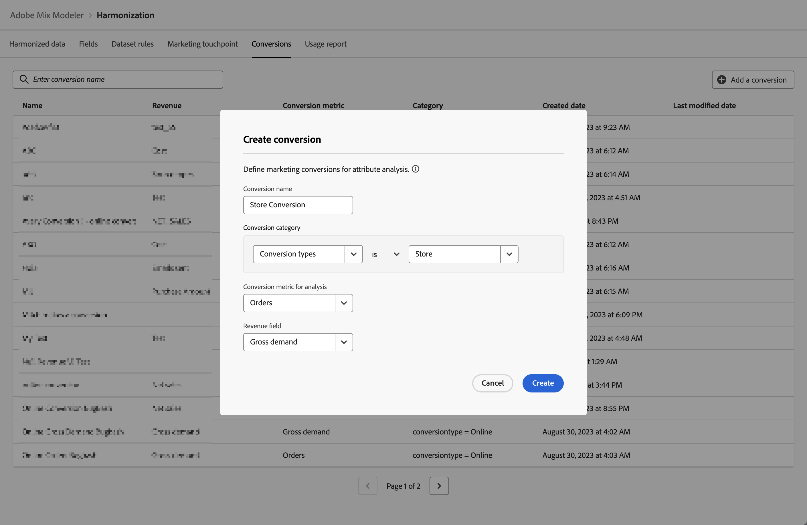

# 轉換

轉換事件是業務目標，可識別行銷活動的影響。 範例：電子商務訂單、店內購買、網站造訪等。

您可以定義歸因分析的行銷轉換。

## 管理轉換

若要檢視可用轉換的表格，請在Mix Modeler介面中：

1. 選取  **[!UICONTROL Harmonized data]** 從左側邊欄。

1. 選取 **[!UICONTROL Conversions]** 從頂端列。 您會看到轉換率表格。

表格資料欄會指定轉換的詳細資訊：

| 欄名稱 | 詳細資料 |
| --- | ---|
| 名稱 | 轉換的名稱。 |
| 收入 | 用於計算轉換收入的協調資料量度。 |
| 轉換量度 | 用作分析轉換量度的協調資料量度。 |
| 已建立 | 建立轉換的日期和時間。 |
| 上次修改時間 | 上次修改轉換的日期和時間。 |

{style="table-layout:auto"}

## 新增轉換

若要新增轉換，請在  **[!UICONTROL Harmonized data]** > **[!UICONTROL Conversion]** Mix Modeler介面：

1. 選取  **[!UICONTROL Add a conversion]**.

1. 在 **[!UICONTROL Create Conversion]** 對話方塊：

   1. 輸入名稱 **[!UICONTROL Conversion]**，例如 `Store Conversions`.

   1. 定義 **[!UICONTROL Conversion category]**.

      1. 選取值，從 **[!UICONTROL *選取協調……*]**，例如 `Conversion Type`.

      1. 選取運運算元的值 ，例如 **[!UICONTROL is]**.

      1. 選取值，從 **[!UICONTROL *選取值&#x200B;*]**或輸入值，例如&#x200B;**[!UICONTROL Store]**.

   1. 選取協調欄位，從 **[!UICONTROL Conversion metric for analysis]**，例如 **[!UICONTROL Orders]**.

   1. 選取協調欄位，從 **[!UICONTROL Revenue field]**，例如 **[!UICONTROL Gross Demand]**.

   1. 若要建立轉換，請選取 **[!UICONTROL Create]**. 若要取消轉換的建立，請選取 **[!UICONTROL Cancel]**.

      

1. 建立後，轉換會被新增到轉換表格中。
