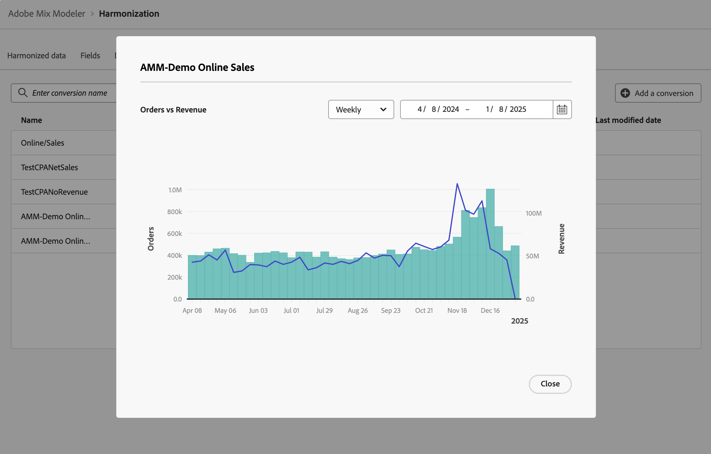

# 轉換

轉換事件是業務目標，可識別行銷活動的影響。 範例：電子商務訂單、店內購買、網站造訪等。

您可以定義歸因分析的行銷轉換。

## 管理轉換

若要檢視可用轉換的表格，請在Mix Modeler介面中：

1. 從左側邊欄選取 **[!UICONTROL Harmonized data]**。

1. 從頂端列選取&#x200B;**[!UICONTROL Conversions]**。 您會看到轉換率表格。

表格資料欄會指定轉換的詳細資訊：

| 欄名稱 | 詳細資料 |
| --- | ---|
| 名稱 | 轉換的名稱。 |
| 收入 | 用於計算轉換收入的協調資料量度。 |
| 轉換量度 | 用作分析轉換量度的協調資料量度。 |
| 類別 | 轉換的轉換類別。 |
| 已建立 | 建立轉換的日期和時間。 |
| 上次修改時間 | 上次修改轉換的日期和時間。 |

## 新增轉換

若要新增轉換，請在Mix Modeler的 **[!UICONTROL Harmonized data]** > **[!UICONTROL Conversion]**&#x200B;介面中：

1. 選取 **[!UICONTROL Add a conversion]**。

1. 在&#x200B;**[!UICONTROL Create conversion]**&#x200B;對話方塊：

   1. 輸入&#x200B;**[!UICONTROL Conversion]**&#x200B;的名稱，例如`Store Conversions`。

   1. 定義&#x200B;**[!UICONTROL Conversion category]**。

      1. 從&#x200B;**[!UICONTROL *選取一個值，然後選取協調……*]**，例如`Conversion types`。

      1. 選取運運算元的值，例如&#x200B;**[!UICONTROL is]**。

      1. 從&#x200B;**[!UICONTROL *選取值&#x200B;*]**或輸入值，例如&#x200B;**[!UICONTROL Store]**。

   1. 從&#x200B;**[!UICONTROL Conversion metric for analysis]**&#x200B;中選取協調欄位，例如&#x200B;**[!UICONTROL Orders]**。

   1. 從&#x200B;**[!UICONTROL Revenue field]**&#x200B;中選取協調欄位，例如&#x200B;**[!UICONTROL Gross Demand]**。

   1. 若要建立轉換，請選取&#x200B;**[!UICONTROL Create]**。 若要取消轉換的建立，請選取&#x200B;**[!UICONTROL Cancel]**。

      

1. 建立後，轉換會被新增到轉換表格中。

## 檢視詳細資料

若要檢視轉換的詳細資訊，請執行下列動作：

1. 當游標停留在資料表中的轉換名稱上時，選取。

1. 選取 **檢視詳細資料**。 對話方塊會顯示轉換的詳細資料。 如需詳細資訊，請參閱[新增轉換](#add-a-conversion)。 選取&#x200B;**[!UICONTROL Cancel]**&#x200B;以關閉對話方塊。

## 檢視報告

若要檢視轉換報表：

1. 當游標停留在資料表中的轉換名稱上時，選取。

1. 選取 **檢視報告**。 對話方塊會顯示轉換報表。

   

   * 若要變更報告粒度，請從&#x200B;**[!UICONTROL Weekly]**&#x200B;下拉式選單中選取值。
   * 若要變更要報告的期間，請輸入開始與結束日期，或使用在行事曆快顯視窗中定義期間。

1. 選取&#x200B;**[!UICONTROL Close]**&#x200B;以關閉對話方塊。

## 刪除轉換

若要刪除轉換：

1. 選取 **刪除** （當游標停留在資料表中的轉換名稱上時）。
1. 在&#x200B;**[!UICONTROL Delete conversion]**&#x200B;對話方塊確認對話方塊中，選取&#x200B;**[!UICONTROL Delete]**&#x200B;以永久刪除轉換。
