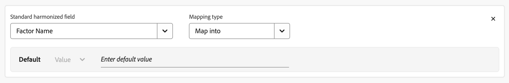
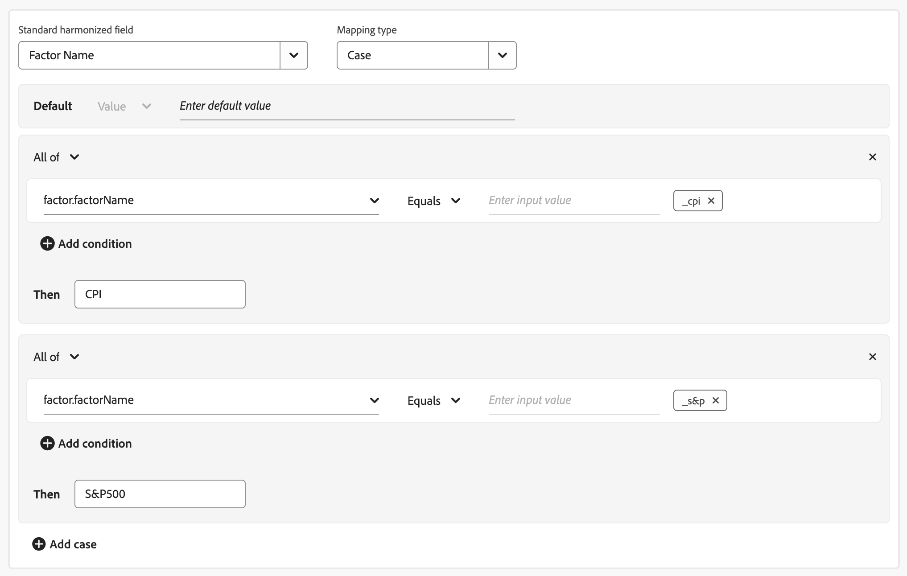
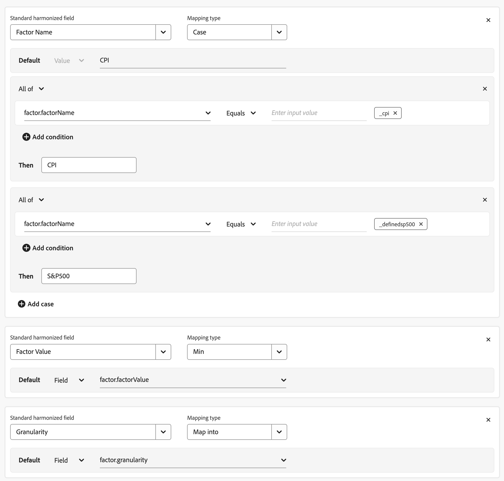

# 資料集規則

資料集規則可協助您將協調的欄位與您在Mix Modeler中擷取的資料欄位進行對應。

* 對於您在Adobe Experience Platform中擷取的彙總資料，您可以將一個或多個可用的資料集欄位對應到適當的和諧欄位。
* 對於事件資料，您可以直接或使用條件，個別將一個或多個和諧的欄位對應到資料集中的欄位。

## 管理資料集規則

若要檢視可用資料集規則的表格，請在Mix Modeler介面中：

1. 從左側邊欄選取 **[!UICONTROL Harmonized data]**。

1. 從頂端列選取&#x200B;**[!UICONTROL Dataset rules]**。 您會看到資料集規則的表格。

您可以使用 **[!UICONTROL _輸入資料集名稱_]**&#x200B;來快速搜尋資料集。

表格欄會指定資料集規則的詳細資料：

| 欄名稱 | 詳細資料 |
| ---------------------- | ----------|
| **[!UICONTROL Dataset]** | 資料集的名稱。  使用為資料集選取動作。 您可以：<ul><li> **[!UICONTROL View]**&#x200B;以檢視資料集規則設定。 所有欄位均已停用。</li><li> **[!UICONTROL Edit]**&#x200B;以編輯資料集規則設定。</li><li> **[!UICONTROL Delete]**&#x200B;以刪除資料集規則設定。 系統會提示您在「刪除資料集」對話方塊中確認刪除。 選取&#x200B;**[!UICONTROL Delete]**&#x200B;以永久刪除資料集規則組態。</li><ul> |
| **[!UICONTROL Source]** | 資料集的來源： Adobe Analytics、體驗事件、摘要（彙總）或取用者體驗事件。 |
| **[!UICONTROL Schema]** | 資料集符合的結構描述。 您可以在 [結構描述](../ingest-data/schemas.md)的結構描述編輯器中，快速選取結構描述名稱以在新的索引標籤中開啟結構描述。 |
| **[!UICONTROL Granularity]** | 資料集中的資料粒度。 可能的值為每日、每週、每月或每年。 |
| **[!UICONTROL Start of the week]** | 針對特定資料集，指定將一週中的哪一天視為新一週的開始。 |
| **[!UICONTROL Status]** | 欄位的狀態： 草稿或作用中 |
| **[!UICONTROL Last modified]** | 上次修改資料集規則的資料和時間。 |

{style="table-layout:auto"}

### 建立資料集規則

若要建立資料集規則，請在Mix Modeler的 **[!UICONTROL Harmonized data]** > **[!UICONTROL Dataset rules]**&#x200B;介面中，選取&#x200B;**[!UICONTROL Create a dataset rule]**&#x200B;精靈中的&#x200B;**[!UICONTROL Dataset rules configuration]**。

在&#x200B;**[!UICONTROL Create]**&#x200B;畫面中，

1. 在&#x200B;**[!UICONTROL Dataset details]**&#x200B;中，從&#x200B;**[!UICONTROL Select dataset]**&#x200B;中選取資料集以開始設定。 在清單中，資料集是在&#x200B;**[!UICONTROL Summary]**、**[!UICONTROL Adobe Analytics]**、**[!UICONTROL Experience Event]**、**[!UICONTROL Factors]**&#x200B;和&#x200B;**[!UICONTROL Consumer Experience Events]**&#x200B;中分類。

1. 選取&#x200B;**[!UICONTROL Start of the week]**&#x200B;的日期。

1. 選取&#x200B;**[!UICONTROL Daily]**&#x200B;的&#x200B;**[!UICONTROL Weekly]**、**[!UICONTROL Monthly]**、**[!UICONTROL Yearly]**&#x200B;或&#x200B;**[!UICONTROL Granularity]**。

1. 當您已選取&#x200B;**[!UICONTROL Summary]**&#x200B;或&#x200B;**[!UICONTROL Factors]**&#x200B;類別的資料集時，請為&#x200B;**[!UICONTROL Aggregation]**&#x200B;選取&#x200B;**[!UICONTROL Replacement]**&#x200B;或&#x200B;**[!UICONTROL Data restatement is by]**。

   對於行銷分析師而言，來自發佈商的報表資料非常重要，因為與發佈商合作通常意味著要花費大量成本，而報表資料的變更可能會導致非常不同的深入分析和投資計畫。 此外，行銷分析人員需要精確資料，才能獲得正確的深入分析和令人信服的提案，進而獲得利害關係人的信心。 然而，這些發佈者(例如Google和Facebook)在調解資料時，通常會重述或刪除報表資料。 大部分變更的時間範圍都在報告媒體效能的7天內。 30天內可能會對資料進行其他變更。 一般而言，30天後，書籍會被視為已關閉且資料完整。

   Mix Modeler支援資料重述。 以確保用於報表、建模和計畫的資料是準確的。 而且資料能夠支援品牌和行銷分析人員的期望和需求。

   您可以傳送重述的摘要資料列作為Experience Platform資料集中的增量資料列，而協調服務會以該重述資料更新協調的資料集。 同樣地，您也可以移除需要反映在協調服務中的摘要資料列。

1. 在&#x200B;**[!UICONTROL Map to harmonized fields]**&#x200B;區段中，從&#x200B;**[!UICONTROL Standard harmonized field]**&#x200B;選取協調欄位。 若要[快速建立新的協調欄位](/help/harmonize-data/fields.md#add-a-harmonized-field)，請選取&#x200B;**[!UICONTROL Create new]**。

   * 當選取的協調欄位屬於型別量度時：

      1. 從&#x200B;**[!UICONTROL Count]**&#x200B;中選取&#x200B;**[!UICONTROL Sum]**&#x200B;或&#x200B;**[!UICONTROL Mapping type]**。

      1. 選取您預設要與協調欄位對應的&#x200B;**[!UICONTROL *AEP資料集欄位&#x200B;*]**。

   * 當選取的欄位屬於型別維度時：

      1. 從&#x200B;**[!UICONTROL Map Into]**&#x200B;中選取&#x200B;**[!UICONTROL Case]**&#x200B;或&#x200B;**[!UICONTROL Mapping type]**。

      1. 當您已選取&#x200B;**[!UICONTROL Map Into]**&#x200B;時，請選取&#x200B;**[!UICONTROL Field]**&#x200B;和&#x200B;**[!UICONTROL *AEP資料集欄位&#x200B;*]**或&#x200B;**[!UICONTROL Value]**，以及預設值，以將協調的欄位依預設對應到資料集欄位或輸入的值。

      1. 當您選取&#x200B;**[!UICONTROL Case]**&#x200B;時，請選取&#x200B;**[!UICONTROL Field]**&#x200B;和&#x200B;**[!UICONTROL *AEP資料集欄位&#x200B;*]**或&#x200B;**[!UICONTROL Value]**，以及預設值，以依預設將協調欄位對應到資料集欄位或輸入的值。

         1. 若要明確設定值，您可以定義一或多個案例，由一或多個條件組成。 每個條件都可以檢查特定的&#x200B;**[!UICONTROL *AEP資料集欄位&#x200B;*]**，無論是&#x200B;**[!UICONTROL Exists]**或&#x200B;**[!UICONTROL Not Exists]**，或是&#x200B;**[!UICONTROL Contains]**、**[!UICONTROL Not Contains]**、**[!UICONTROL Equals]**、**[!UICONTROL Not Equals]**、**[!UICONTROL Starts With]**或&#x200B;**[!UICONTROL Ends With]**，輸入於**[!UICONTROL *&#x200B;輸入的值&#x200B;*]**。

         1. 若要新增其他案例，請選取 **[!UICONTROL Add case]**，若要新增其他條件，請選取 **[!UICONTROL Add condition]**。

         1. 若要刪除案例或條件，請選取對應容器中的。

         1. 若要選取任何或所有條件是否應該適用於案例，請選取&#x200B;**[!UICONTROL Any of]**&#x200B;或&#x200B;**[!UICONTROL All of]**。

         1. 若要設定案例的結果值，請在&#x200B;**[!UICONTROL Then]**&#x200B;輸入值。

     下列範例：

      * 使用&#x200B;**[!UICONTROL Map Into]** **[!UICONTROL Mapping type]**&#x200B;將&#x200B;**[!UICONTROL Channel Type At Source]**&#x200B;協調欄位對應到&#x200B;**[!UICONTROL channel_type]**&#x200B;資料集中的&#x200B;**[!DNL Luma Transactions]**&#x200B;欄位。

      * 使用&#x200B;**[!UICONTROL Case]** **[!UICONTROL Mapping type]**&#x200B;有條件地將&#x200B;**[!UICONTROL marketing.campaignName]**&#x200B;資料集中的&#x200B;**[!DNL Luma Transactions]**&#x200B;欄位值對應到&#x200B;**[!UICONTROL Campaign]**&#x200B;協調欄位。 「行銷活動協調」欄位設為：

         * `Black Friday`為&#x200B;**[!UICONTROL marketing.campaignName]**&#x200B;或`_black_friday`時的`BlackFriday`。
         * 到所有其他情況下的&#x200B;**[!UICONTROL marketing.campaignName]**&#x200B;的值。

        

1. 選取 **[!UICONTROL Add field]**&#x200B;以定義其他欄位。

完成後，選取&#x200B;**[!UICONTROL Save as draft]**&#x200B;以儲存規則的草稿版本，或選取&#x200B;**[!UICONTROL Save]**&#x200B;以儲存並啟動規則。 選取&#x200B;**[!UICONTROL Cancel]**&#x200B;以取消規則設定。

>[!NOTE]
>
>摘要資料集規則的專用&#x200B;**[!UICONTROL Map to harmonized fields]**&#x200B;體驗已過時。 所有資料集規則現在都會使用類似的&#x200B;**[!UICONTROL Map to harmonized fields]**&#x200B;體驗，無論資料集型別為何。 針對您已使用已棄用的&#x200B;**[!UICONTROL Map to harmonized fields]**&#x200B;體驗定義規則的摘要資料集，您可能想要針對一般&#x200B;**[!UICONTROL Map to harmonized field]**&#x200B;體驗驗證這些規則。
>

#### 摘要資料集

當您從摘要資料集對應標準協調欄位時，Mix Modeler會嘗試推斷對應的Experience Platform資料集欄位。 成功時：

* 如果欄位屬於型別維度，則會選取&#x200B;**[!UICONTROL Map into]**&#x200B;作為&#x200B;**[!UICONTROL Mapping type]**。
* 如果欄位屬於型別量度，則會選取&#x200B;**[!UICONTROL Sum]**&#x200B;作為&#x200B;**[!UICONTROL Mapping type]**。
* 已選取&#x200B;**[!UICONTROL Field]**&#x200B;做為&#x200B;**[!UICONTROL Default]**&#x200B;對應型別。
* 系統會自動為&#x200B;*Experience Platform資料集欄位*&#x200B;插入對應的AEP資料集欄位。

如果這些值不正確或不支援您的特定使用案例，您可以變更任何建議值。

#### 因子資料集

您可將協調的欄位對應到因子資料集中的欄位，因此您可以[新增因子作為模型組態的一部分](/help/models/build.md)。

將協調欄位對應至因子資料集中的欄位時，將套用下列內容：

##### 因子名稱

當您從因子資料集對應標準協調因子欄位且因子資料集包含單一因子時，請使用&#x200B;**[!UICONTROL Map into]**&#x200B;作為&#x200B;**[!UICONTROL Mapping type]**&#x200B;並輸入&#x200B;**[!UICONTROL Factor Name]**&#x200B;協調欄位的預設值。

如果因子資料集包含多個因子，請使用&#x200B;**[!UICONTROL Case As]**&#x200B;做為&#x200B;**[!UICONTROL Mapping Type]**，以定義「因子名稱」協調欄位與每個不同因子名稱之間的對應。

##### 因子型別

在因子資料集和結構描述中，此欄位是選用欄位。 如果在因子資料集和結構描述中定義&#x200B;**[!UICONTROL Factor type]**&#x200B;並指定&#x200B;**[!UICONTROL Internal]**&#x200B;或&#x200B;**[!UICONTROL External]**，則會使用提供的值。 如果未指定值，則使用預設值&#x200B;**[!UICONTROL Internal]**。

##### 值型別

在因子資料集和結構描述中，此欄位是選用欄位。 如果在因子資料集和結構描述中定義&#x200B;**[!UICONTROL Value type]**&#x200B;並指定&#x200B;**[!UICONTROL Actual]**&#x200B;或&#x200B;**[!UICONTROL Forecasted]**，則會使用提供的值。 如果未指定值，則使用預設值&#x200B;**[!UICONTROL Actual]**。

##### 詳細程度

當因子資料集內的所有因子都有相同的來源粒度時，您可以為因子資料集的粒度定義資料集規則。

一旦Factor資料集協調，所有資料集就會在協調的資料集中符合最高層級的詳細程度。

##### 因子值

對於&#x200B;**[!UICONTROL Factor value]**&#x200B;協調欄位，請使用其中一個彙總運運算元做為&#x200B;**[!UICONTROL Mapping Type]**。 在因子資料集中定義多個因子時，彙總運運算元會套用至所有因子。

##### 範例

* 您有一個因子資料集，其中包含下列範例資料：

  | 時間戳記 | 因子名稱 | 因子值 |
  |---|---|---:|
  | 2025年3月13日 | _definedsp500 | 10 |
  | 2025年3月13日 | _cpi | 20 |
  | 2025年3月14日 | _definedsp500 | 30 |
  | 2025年3月14日 | _cpi | 40 |
  | 2025年3月15日 | _definedsp500 | 50 |
  | 2025年3月15日 | _cpi | 60 |

* 而且您為&#x200B;**[!UICONTROL Factor Name]**、**[!UICONTROL Factor Value]**&#x200B;和&#x200B;**[!UICONTROL Granularity]**&#x200B;定義下列資料集規則：

  

* 接著會產生下列的協調資料：

  | 因子名稱 | 因子值 | 因子型別 | 值型別 |
  |---|---:|---|---|
  | CPI | 20 | 內部 | 實際 |
  | S&amp;P 500 | 10 | 內部 | 實際 |

  由於沒有為&#x200B;**[!UICONTROL Factor Type]**&#x200B;和&#x200B;**[!UICONTROL Value Type]**&#x200B;定義資料集規則，因此會使用預設值。

### 編輯資料集規則

若要編輯資料集規則，請在Mix Modeler的 **[!UICONTROL Harmonized data]** > **[!UICONTROL Dataset rules]**&#x200B;介面中：

1. 針對您要編輯的資料集規則，在更多&#x200B;**[!UICONTROL Dataset]**。
1. 從內容功能表中，選取 **[!UICONTROL Edit]**&#x200B;以開始編輯資料集規則。 如需詳細資訊，請參閱[建立資料集規則](#create-a-dataset-rule)。

### 刪除資料集規則

若要刪除資料集規則，請在Mix Modeler的 **[!UICONTROL Harmonized data]** > **[!UICONTROL Dataset rules]**&#x200B;介面中：

1. 針對您要刪除的資料集規則，在更多&#x200B;**[!UICONTROL Dataset]**。
1. 從內容功能表中，選取 **[!UICONTROL Delete]**&#x200B;以刪除資料集規則。 系統會提示您進行確認。 選取&#x200B;**[!UICONTROL Delete]**&#x200B;以永久刪除選取的資料集規則。

## 同步資料

若要在協調資料和摘要及/或事件資料集之間同步資料，同時套用資料集規則中的邏輯：

1. 選擇「**[!UICONTROL Sync data]**」。

1. 從&#x200B;**[!UICONTROL Sync data for dataset rules]**&#x200B;對話方塊中，選取
   * **[!UICONTROL Refresh harmonized data for summary datasets]**，
   * **[!UICONTROL Refresh harmonized data for event datasets]**，或
   * **[!UICONTROL Refresh harmonized data for both summary + event datasets]**。

1. 若要根據已定義的資料集規則，在資料集中的已協調資料和資料之間開始同步，請選取&#x200B;**[!UICONTROL Sync]**。 若要取消同步處理，請選取&#x200B;**[!UICONTROL Cancel]**。

   

## 資料合併偏好設定 {#data-merge-preferences}

>[!CONTEXTUALHELP]
>id="harmonizeddata_datasetrules_datamergepreferences"
>title="預設量度偏好設定"
>abstract="在協調期間，如果有多個資料來源嘗試更新指定頻道的量度欄位，則會套用預設偏好設定。 此偏好設定會套用至沙箱層級，除非某些量度偏好設定（若以下定義）已覆寫。"

>[!NOTE]
>
>[!BADGE 測試版]{type=Informative}資料合併偏好設定是測試版功能，其功能可能會有所變更。

為確保模型預測準確，您可以定義資料合併偏好設定。 此功能可讓使用者解決合併摘要層級與事件層級資料後的任何衝突。

您可以設定預設量度偏好設定，以在發生衝突更新時套用。 此預設量度可為下列三個選項之一：

* **[!UICONTROL Summary data]**
* **[!UICONTROL Sum of summary and event data]**
* **[!UICONTROL Event data]**

在協調期間，當多個資料來源嘗試更新給定頻道的量度欄位時，會套用使用者設定的預設偏好設定。 此偏好設定會套用至沙箱層級，除非已針對另外設定的特定量度型偏好設定覆寫。

在&#x200B;**[!UICONTROL Metric based preferences]**&#x200B;底下，使用者可以設定特定量度的特定來源（**[!UICONTROL Summary]**&#x200B;或&#x200B;**[!UICONTROL Event]**），以及該量度的對應轉換型別。

典型的使用案例包括：

* 在多個資料集中測量和報告相同的廣告量度，或
* 某些資料集中的量度測量可能不完整，而另一個資料集可能是特定量度的超集，導致重複計數。

### 設定

若要設定資料合併偏好設定：

1. 選取 [!BADGE beta]。

1. 在&#x200B;**[!UICONTROL Data merge preferences]** [!BADGE Beta]{type=Informative}對話方塊中：

   

   * 選取&#x200B;**[!UICONTROL Default metric preference]**。 在協調期間，當多個資料來源更新指定頻道的量度欄位時，會套用選取的預設量度偏好設定。 此偏好設定會套用至沙箱層級，除非根據特定量度的偏好設定加以覆寫。 您可以選取&#x200B;**[!UICONTROL Summary data]**、**[!UICONTROL Event data]**&#x200B;與&#x200B;**[!UICONTROL Sum of summary and event data]**&#x200B;之間。

   * 若要新增特定量度型偏好設定：

      1. 選取 **[!UICONTROL Add a metric]**。
         1. 從&#x200B;**[!UICONTROL *度量選擇&#x200B;*]**清單中選取度量。
         1. 選取&#x200B;**[!UICONTROL CHANNELS]**&#x200B;或&#x200B;**[!UICONTROL CONVERSION TYPES]**。 從清單中選取&#x200B;**[!UICONTROL All]**&#x200B;或特定的管道或轉換型別。
         1. 選取&#x200B;**[!UICONTROL Summary]**&#x200B;或&#x200B;**[!UICONTROL Event]**，以指定合併資料時，彙總資料或事件資料是否偏好量度（以及所有或選取的管道）。

         若要新增一或多個其他管道或轉換型別：

         1. 選取 **[!UICONTROL Add a channel]**&#x200B;或 **[!UICONTROL Add a conversion type]**。
         1. 選取「**[!UICONTROL Summary]**」或「**[!UICONTROL Event]**」。

         若要刪除管道或轉換型別，請選取。

      1. 若要新增更具體的量度型偏好設定，請重複上一步驟。

   * 若要刪除現有的特定量度型偏好設定，請選取。

1. 選取&#x200B;**[!UICONTROL Save]**&#x200B;以儲存資料合併偏好設定。 已開始重新同步資料。  選取&#x200B;**[!UICONTROL Cancel]**&#x200B;以取消。

## 刪除來源資料集

當您刪除協調資料中使用的來源資料集時，該來源資料集上的基礎專案會從[[!UICONTROL Harmonized data]](/help/harmonize-data/overview.md)中移除。 不過，含有已刪除來源資料集的資料集規則仍會保留在資料集規則設定清單中，且圖示表示來源資料集已刪除。 若要取得更多詳細資料：

* 從內容功能表選取和 **[!UICONTROL View]**。
**[!UICONTROL Dataset rule mapping - Fields]**&#x200B;對話方塊會顯示已刪除的來源資料集以及資料集規則設定中所使用欄位的相關資訊。

當您返回&#x200B;**[!UICONTROL Dataset rules]**&#x200B;設定時，您會看到一個對話方塊，說明一個或多個來源資料集已刪除。 協調的資料會在下一次臨時或排程的同步處理上受到影響。 檢閱您的資料集規則設定。

在下次臨機同步處理或排程同步處理時，會更新已協調的資料，而不會刪除來源資料。 不過，您仍會繼續看到警示對話方塊，提示您根據已刪除的來源資料集刪除資料集規則。 此警報可讓使用者檢視及評估已刪除資料集中受影響的欄位。 和用於判斷對行銷接觸點或可用於任何模型的轉換的影響。 審查並減輕此影響後，您應從資料集規則設定清單中刪除資料集規則。
