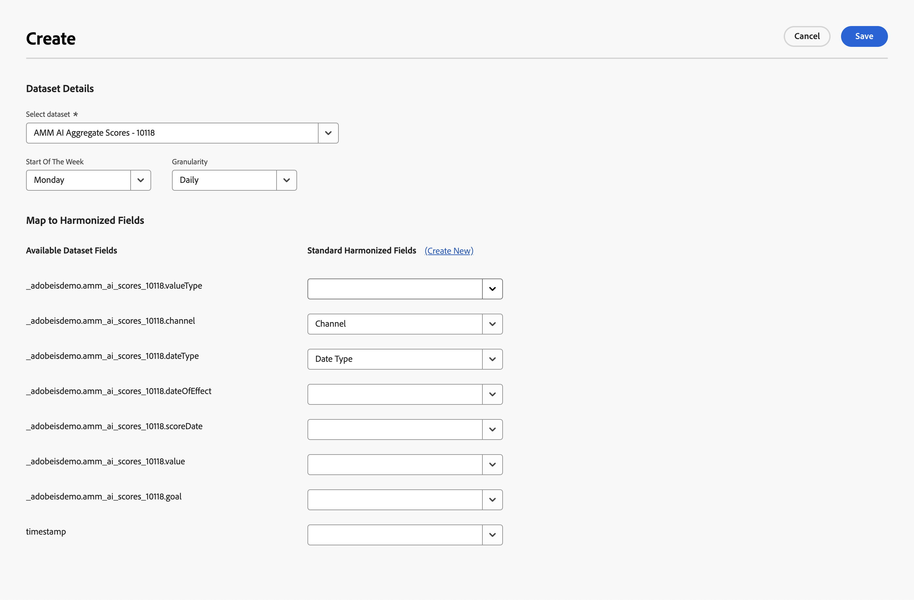
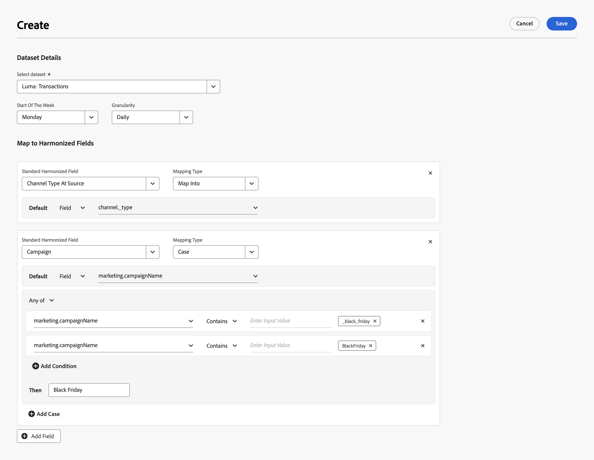
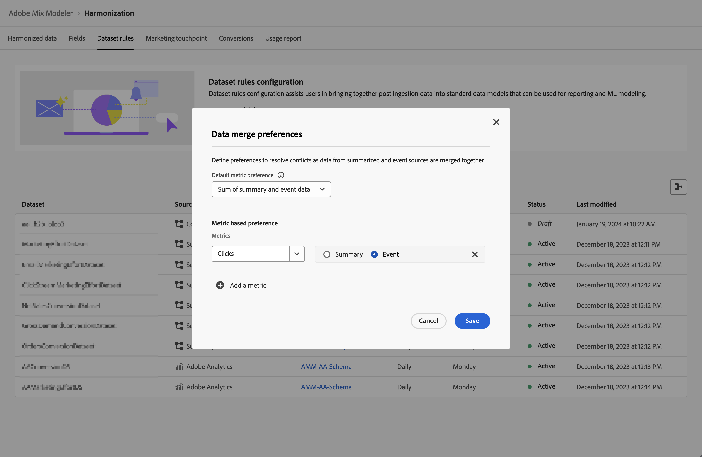
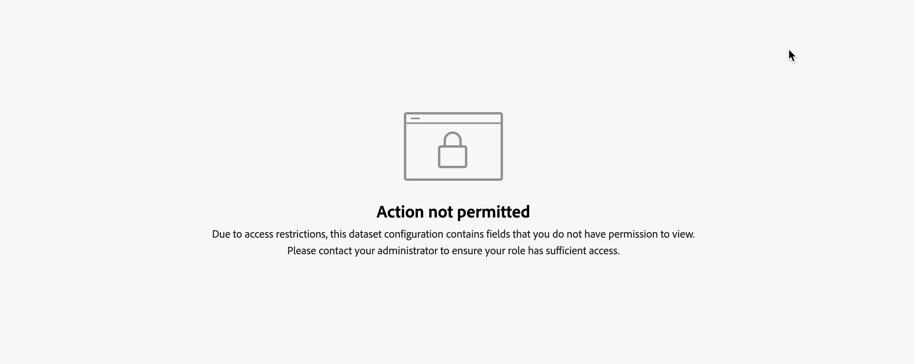

# 資料集規則

資料集規則可協助您將協調的欄位與您在Mix Modeler中擷取的資料欄位進行對應。

* 對於您在Adobe Experience Platform中擷取的彙總資料，您可以將一個或多個可用的資料集欄位對應到適當的和諧欄位。
* 對於事件資料，您可以直接或使用條件，個別將一個或多個和諧的欄位對應到資料集中的欄位。

## 管理資料集規則

若要檢視可用資料集規則的表格，請在Mix Modeler介面中：

1. 選取  **[!UICONTROL Harmonized data]** 從左側邊欄。

1. 選取 **[!UICONTROL Dataset rules]** 從頂端列。 您會看到資料集規則的表格。

表格欄會指定資料集規則的詳細資料：

| 欄名稱 | 詳細資料 |
| ---------------------- | ----------|
| 資料集 | 資料集的名稱。 |
| 來源 | 資料集的來源： Adobe Analytics、體驗事件、摘要（彙總）或取用者體驗事件。 |
| 綱要 | 資料集符合的結構描述。 您可以快速選取架構名稱，以在架構編輯器的新索引標籤中開啟架構。  [方案](../ingest-data/schemas.md). |
| 詳細程度 | 資料集中的資料粒度。 可能的值為每日、每週、每月或每年。 |
| 一週開始 | 針對特定資料集，指定將一週中的哪一天視為新一週的開始。 |
| 狀態 | 欄位的狀態： 
● 草稿或 
● 作用中 |
| 上次修改時間 | 上次修改資料集規則的資料和時間。 |

{style="table-layout:auto"}

### 建立資料集規則

若要建立資料集規則，請在  **[!UICONTROL Harmonized data]** > **[!UICONTROL Dataset rules]** 介面中的Mix Modeler，選取 **[!UICONTROL Create a dataset rule]** 在 **[!UICONTROL Dataset rules configuration]** 精靈。

在 **[!UICONTROL Create]** 熒幕，

1. 在 **[!UICONTROL Dataset details]**，選取資料集來源 **[!UICONTROL Select dataset]** 以開始設定。 在清單中，資料集分類為 **[!UICONTROL Consumer Experience Events]**， **[!UICONTROL Adobe Analytics]**， **[!UICONTROL Experience Event]** 和 **[!UICONTROL Summary]**.

1. 選擇日期 **[!UICONTROL Start of the week]**.

1. 選取 **[!UICONTROL Daily]**， **[!UICONTROL Weekly]**， **[!UICONTROL Monthly]** 或 **[!UICONTROL Yearly]** 的 **[!UICONTROL Granularity]**.

1. 當您選取的資料集 **[!UICONTROL Summary]** 類別：

   1. 若要定義資料集的資料是否彙總或取代現有資料，請選取「 」 **[!UICONTROL Aggregation]** 或 **[!UICONTROL Replacement]** 的 **[!UICONTROL Data restatement is by]**.

   1. 對應每個 **[!UICONTROL Available dataset fields]** 至對應的 **[!UICONTROL Standard harmonized fields]** 在 **[!UICONTROL Map to harmonized fields]**. 如果您不想將資料集欄位對應到協調的欄位，請明確選取 **[!UICONTROL -- None --]**.

   1. 如果您需要清單中沒有的新協調欄位，請選取 **[!UICONTROL Create New]** 建立新的協調欄位。 您會看到對話方塊，如中所述 [加入新的協調欄位](fields.md#add-a-harmonized-field).

   1. 規則的所有欄位完成對應後，選取 **[!UICONTROL Save as draft]** 儲存規則的草稿版本或 **[!UICONTROL Save]** 以儲存及啟動規則。 選取 **[!UICONTROL Cancel]** 以取消規則組態。

      

1. 當您選取事件類別資料集時(**[!UICONTROL Experience Events]**， **[!UICONTROL Adobe Analytics]**， **[!UICONTROL Consumer Experience Events]**)，在下面的方塊中 **[!UICONTROL Map to harmonized fields]**：

   1. 選取協調欄位，從 **[!UICONTROL Standard harmonized field]**.

   1. 當選取的協調欄位屬於型別量度時：

      1. 選取 **[!UICONTROL Count]** 或 **[!UICONTROL Sum]** 從 **[!UICONTROL Mapping type]**.

      1. 選取 **[!UICONTROL *aep資料集欄位&#x200B;*]**您希望依預設將協調欄位對應到的欄位。

   1. 當選取的欄位屬於型別維度時：

      1. 選取 **[!UICONTROL Map Into]** 或 **[!UICONTROL Case]** 從 **[!UICONTROL Mapping type]**.

      1. 當您已選取 **[!UICONTROL Map Into]**，選取 **[!UICONTROL Field]** 和 **[!UICONTROL *aep資料集欄位&#x200B;*]**或&#x200B;**[!UICONTROL Value]**和預設值，預設會將協調的欄位對應到資料集欄位或輸入的值。

      1. 當您選取 **[!UICONTROL Case]**，選取 **[!UICONTROL Field]** 和 **[!UICONTROL *aep資料集欄位&#x200B;*]**或&#x200B;**[!UICONTROL Value]**和預設值，預設會將協調的欄位對應到資料集欄位或輸入的值。

         1. 若要明確設定值，您可以定義一或多個案例，由一或多個條件組成。 每個條件都可以檢查特定 **[!UICONTROL *aep資料集欄位&#x200B;*]**是否&#x200B;**[!UICONTROL Exists]**或&#x200B;**[!UICONTROL Not Exists]**或是&#x200B;**[!UICONTROL Contains]**，**[!UICONTROL Not Contains]**，**[!UICONTROL Equals]**，**[!UICONTROL Not Equals]**，**[!UICONTROL Starts With]**，或&#x200B;**[!UICONTROL Ends With]**輸入的值**[!UICONTROL *&#x200B;輸入輸入值&#x200B;*]**.

         1. 若要新增其他案例，請選取  **[!UICONTROL Add case]**，若要新增其他條件，請選取「 」  **[!UICONTROL Add condition]**.

         1. 若要刪除案例或條件，請選取  於對應的容器中。

         1. 若要選取任何或所有條件是否應該適用於案例，請選取 **[!UICONTROL Any of]** 或 **[!UICONTROL All of]**.

         1. 若要設定案例的結果值，請在以下位置輸入值： **[!UICONTROL Then]**.

      以下範例

      * 使用 **[!UICONTROL Map Into]** **[!UICONTROL Mapping type]** 對應 **[!UICONTROL Channel Type At Source]** 與的協調欄位 **[!UICONTROL channel_type]** 欄位來自 **[!DNL Luma Transactions]** 資料集。

      * 使用 **[!UICONTROL Case]** **[!UICONTROL Mapping type]** 有條件地對應 **[!UICONTROL marketing.campaignName]** 中的欄位 **[!DNL Luma Transactions]** 資料集至 **[!UICONTROL Campaign]** 協調的欄位。 「行銷活動協調」欄位設為：

         * `Black Friday` 當 **[!UICONTROL marketing.campaignName]** 是 `_black_friday` 或 `BlackFriday`.
         * 至的值 **[!UICONTROL marketing.campaignName]** 在所有其他情況下。

        

1. 選取  **[!UICONTROL Add field]** 以定義其他欄位。

完成後，選取 **[!UICONTROL Save as draft]** 儲存規則的草稿版本或 **[!UICONTROL Save]** 以儲存及啟動規則。 選取 **[!UICONTROL Cancel]** 以取消規則組態。

### 編輯資料集規則

若要編輯資料集規則，請在  **[!UICONTROL Harmonized data]** > **[!UICONTROL Dataset rules]** Mix Modeler介面：

1. 選取  在 **[!UICONTROL Dataset]** 要編輯的資料集規則的欄。
1. 從內容功能表中，選取  **[!UICONTROL Edit]** 以開始編輯資料集規則。 請參閱 [建立資料集規則](#create-a-dataset-rule) 以取得更多詳細資料。

### 刪除資料集規則

若要刪除資料集規則，請在  **[!UICONTROL Harmonized data]** > **[!UICONTROL Dataset rules]** Mix Modeler介面：

1. 選取  在 **[!UICONTROL Dataset]** 要刪除的資料集規則的欄。
1. 從內容功能表中，選取  **[!UICONTROL Delete]** 以刪除資料集規則。 系統會提示您進行確認。 選取 **[!UICONTROL Delete]** 以永久刪除選取的資料集規則。

## 同步資料

若要在調和的資料和摘要及/或事件資料集之間同步資料，請遵循資料集規則中的所有邏輯：

1. 選擇「**[!UICONTROL Sync data]**」。

1. 從 **[!UICONTROL Sync data for dataset rules]** 對話方塊，選取
   * **[!UICONTROL Refresh harmonized data for summary datasets]**，
   * **[!UICONTROL Refresh harmonized data for event datasets]**，或
   * **[!UICONTROL Refresh harmonized data for both summary + event datasets]**。

1. 若要根據已定義的資料集規則，在資料集中的協調資料和資料之間開始同步，請選取「 」 **[!UICONTROL Sync]**. 若要取消同步，請選取 **[!UICONTROL Cancel]**.

   

## 資料合併偏好設定

>[!NOTE]
>
>[!BADGE Beta]{type=Informative}

合併摘要資料和事件資料來源中的資料時，資料合併偏好設定可協助解決衝突。 使用案例包括：

* 在多個資料集中測量和報告相同的廣告量度，或
* 某些資料集中的量度測量可能不完整，而另一個資料集可能是特定量度的超集，導致重複計數。

為確保模型預測準確，您可以定義資料合併偏好設定：

1. 選取  [!BADGE beta] **資料合併偏好設定**.

1. 在 **[!UICONTROL Data merge preferences]** 對話方塊：

   

   * 選取 **[!UICONTROL Default metric preference]**. 在協調期間，當多個資料來源更新指定頻道的量度欄位時，會套用選取的預設量度偏好設定。 此偏好設定會套用至沙箱層級，除非根據特定量度的偏好設定加以覆寫。

   * 若要新增特定量度型偏好設定：

      1. 選取  **[!UICONTROL Add a metric]**.
         1. 從中選擇量度 **[!UICONTROL *量度選取範圍&#x200B;*]**清單。
         1. 選取 **[!UICONTROL CHANNELS]** 或 **[!UICONTROL CONVERSION TYPES]**. 從清單中選取 **[!UICONTROL All]** 或特定管道或轉換型別。
         1. 選取 **[!UICONTROL Summary]** 或 **[!UICONTROL Event]** 指定在合併資料時，是否偏好使用量度的摘要資料或事件資料（以及所有或選取的管道）。

若要新增一或多個其他管道或轉換型別：

         1. 選取  **[!UICONTROL Add a channel]** 或  **[!UICONTROL Add a conversion type]**.
         1. 選取「**[!UICONTROL Summary]**」或「**[!UICONTROL Event]**」。

若要刪除管道或轉換型別， select .

      1. 若要新增更具體的量度型偏好設定，請重複上一步驟。

   * 若要刪除現有的特定量度型偏好設定，請選取 .

1. 選取 **[!UICONTROL Save]** 以儲存資料合併偏好設定。 已開始重新同步資料。  選取 **[!UICONTROL Cancel]** 以取消。

## 欄位層級存取控制

為協調的資料集設定資料集規則時，Experience Platform [以屬性為基礎的存取控制](https://experienceleague.adobe.com/en/docs/experience-platform/access-control/abac/overview) 在欄位層級強制執行。 當標籤附加至結構描述欄位並啟用拒絕您存取該欄位的作用中原則時，欄位會受到限制。 因此：

* 您沒有在建立資料集規則時看到為您限制的結構描述欄位。
* 您無法檢視或編輯一或多個限制您使用的結構描述欄位的對應。 當您編輯或檢視包含這類受限制欄位的資料集規則時，您會看到下列畫面。
  
