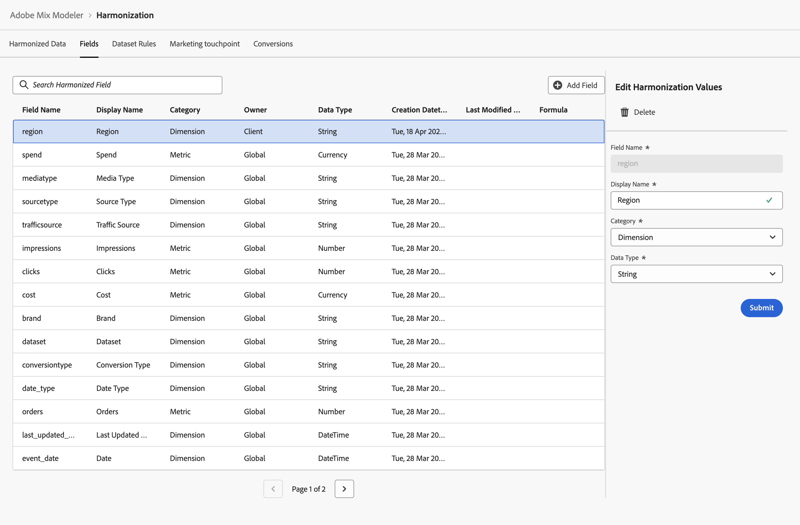

# 協調的欄位

協調的欄位可讓您為概念上相同的資料（源自不同的來源）定義欄位，每個欄位都有該資料自己的定義。 例如，您可以根據資料來源以不同方式定義和命名點按量度。 點按協調欄位可讓您根據點按資料的這些不同來源，為點按量度定義通用術語。

「協調」欄位可讓您定義要用作「協調資料」工作流程一部分的欄位。 您定義的欄位可用於定義資料集規則、行銷接觸點和轉換。

## 全球協調統一欄位

「Adobe混合塑模工具」中預設可用的全域協調欄位為：

| 欄位名稱 | 顯示名稱 | 類別 | 資料類型 | 註解 |
| ---------------------- | ---------------------- | --------- | --------- | --------- |
| 品牌 | 品牌 | 維度 | 字串 |           |
| 行銷活動 | Campaign | 維度 | 字串 |           |
| 頻道 | Channel | 維度 | 字串 |           |
| channel_id | 管道ID | 維度 | 字串 |           |
| channel_type_at_source | 來源的管道型別 | 維度 | 字串 |           |
| 頻道 | Channel | 維度 | 字串 |           |
| 點按次數 | 點擊數 | 量度 | 數字 |           |
| conversiontype | 轉換型別 | 維度 | 字串 |           |
| 成本 | 成本 | 量度 | 貨幣 |           |
| 資料集 | 資料集 | 維度 | 字串 |           |
| date_type | 日期型別 | 維度 | 字串 | 日、周 |
| 已傳送電子郵件 | 電子郵件已傳送 | 量度 | 數字 |           |
| event_date | 日期 | 維度 | 日期時間 |           |
| gross_demand | 總需求 | 量度 | 貨幣 |           |
| 閱聽 | 嵌入次數 | 量度 | 數字 |           |
| last_updated_date | 上次更新日期 | 維度 | 日期時間 |           |
| 連結造訪 | 連結造訪 | 量度 | 數字 |           |
| mediatype | 媒體型別 | 維度 | 字串 |           |
| net_sales | 銷售淨額 | 量度 | 貨幣 |           |
| 訂購 | 訂購 | 量度 | 數字 |           |
| 來源型別 | 來源型別 | 維度 | 字串 |           |
| 支出 | 支出 | 量度 | 貨幣 |           |
| trafficsource | 流量來源 | 維度 | 字串 |           |

{style="table-layout:auto"}

您可以新增、編輯或刪除這些全球協調欄位之上的協調欄位。

## 管理協調的欄位

若要檢視可用協調欄位的表格，請在Adobe組合建模器介面中：

1. 選取  **[!UICONTROL Harmonized data]** 從左側邊欄。

1. 選取 **[!UICONTROL Fields]** 從頂端列。 您會看到協調欄位的表格。

   表格欄指定有關協調欄位的詳細資訊

   | 欄名稱 | 詳細資料 |
   | ---------------------- | ----------|
   | 欄位名稱 | 協調欄位的名稱。 |
   | 顯示名稱 | 協調欄位的顯示名稱。 定義資料集規則、行銷接觸點和轉換定義時，會使用此顯示名稱。 |
   | 類別 | 指定協調的資料欄位是否為 [!UICONTROL Dimension]， a [!UICONTROL Metric] 或 [!UICONTROL Derived]. 衍生類別是使用量度式定義的協調欄位。 |
   | 所有者 | 指出協調的欄位是否為預設欄位([!UICONTROL Global])，或由您定義([!UICONTROL Client])。 |
   | 資料類型 | 指定資料型別([!UICONTROL Number]， [!UICONTROL String]， [!UICONTROL Currency]， [!UICONTROL DateTime])。 |
   | 建立日期時間 | 建立協調欄位的日期和時間。 |
   | 上次修改的日期時間 | 上次修改協調欄位的資料和時間。 |
   | 公式 | 根據衍生類別指定協調欄位的公式。 |

   {style="table-layout:auto"}

1. 若要搜尋特定的協調欄位，請使用  **[!UICONTROL *搜尋協調的欄位&#x200B;*]**.

### 新增協調欄位

若要新增協調欄位，請在  **[!UICONTROL Harmonized data]** > **[!UICONTROL Fields]** Adobe組合建模器中的介面：

1. 選取 新增欄位。

1. 在 **[!UICONTROL Create]** 對話方塊：

   1. 輸入 **[!UICONTROL Field name]**，例如 `region`.
   1. 輸入 **[!UICONTROL Display name]**，例如 `Region`.
   1. 選取 **[!UICONTROL Category]**： **[!UICONTROL Dimension]**， **[!UICONTROL Metric]** 或 **[!UICONTROL Derived]**.

      當您選取 **[!UICONTROL Derived]**，指定 **[!UICONTROL Formula]**. 若要建置有效的算術運算式，請從組合一或多個量度 **[!UICONTROL Insert Metric]** 與一或多個運運算元 **[!UICONTROL + - * / ( )]** . 例如， `[orders]/[impressions]`

   1. 選取 **[!UICONTROL Data type]**.

      - **[!UICONTROL String]** 或 **[!UICONTROL DateTime]**，選取的類別為Dimension時。
      - **[!UICONTROL Number]** 或 **[!UICONTROL Currency]** 當選取的類別為「量度」或「衍生」時。

   1. 選取 **[!UICONTROL Submit]** 以新增協調欄位。 選取 **[!UICONTROL Close]** 關閉對話方塊而不新增協調欄位。

      

### 編輯協調的欄位

您只能編輯您先前建立的協調欄位。 您無法編輯全域協調欄位。

若要編輯協調的欄位，請在  **[!UICONTROL Harmonized data]** > **[!UICONTROL Fields]** Adobe組合建模器中的介面：

1. 選取您要編輯的協調欄位。 例如 **[!UICONTROL Region]**。

1. 在 **[!UICONTROL Edit harmonization values]** 窗格，修改值 **[!UICONTROL Display name]**， **[!UICONTROL Category]**、和 **[!UICONTROL Data type]**.

1. 選取 **[!UICONTROL Submit]** 將變更套用至「協調」欄位。

   

### 刪除協調欄位

您只能刪除您先前建立的協調欄位。 您無法刪除全球協調欄位。

若要刪除協調欄位，請在  **[!UICONTROL Harmonized data]** > **[!UICONTROL Fields]** Adobe組合建模器中的介面：

1. 選取您要刪除的協調欄位，例如 **[!UICONTROL Region]**.

1. 選取  **[!UICONTROL Delete]** 從 **[!UICONTROL Edit harmonization values]** 左窗格。

