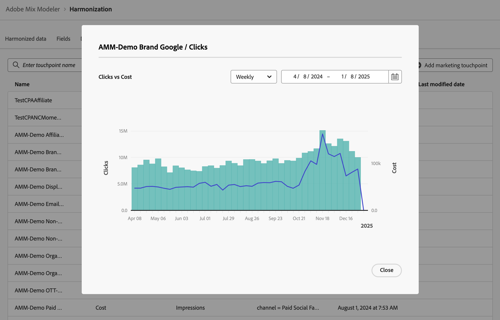

# 行銷接觸點

行銷接觸點是收件者、個人和/或Cookie層級的行銷事件，用於評估行銷投資對數值或收入型轉換的影響。

您可以定義行銷接觸點來協助進行歸因分析。

## 管理行銷接觸點

若要在Mix Modeler介面中檢視可用的行銷接觸點表格：

1. 從左側邊欄選取 **[!UICONTROL Harmonized data]**。

1. 從頂端列選取&#x200B;**[!UICONTROL Marketing touchpoint]**。 您會看到行銷接觸點表格。 如果有更多頁面可供使用，請使用&#x200B;_x _]**的**[!UICONTROL Page _x_&#x200B;上的或在資料表的頁面之間移動。

表格欄會指定行銷接觸點的詳細資訊：

| 欄名稱 | 詳細資料 |
| --- | ---|
| 名稱 | 行銷接觸點的名稱。 |
| 支出量度 | 用於計算接觸點支出的協調資料量度。 |
| 數量度 | 用於計算接觸點數量的協調資料量度。 |
| 規則 | 要使用的接觸點規則。 |
| 已建立 | 建立行銷接觸點的日期和時間。 |
| 上次修改時間 | 上次修改行銷接觸點的日期和時間。 |

{style="table-layout:auto"}

## 新增行銷接觸點

若要新增行銷接觸點，請在Mix Modeler的 **[!UICONTROL Harmonized data]** > **[!UICONTROL Marketing touchpoint]**&#x200B;介面中：

1. 選取新增行銷接觸點。

1. 在&#x200B;**[!UICONTROL Marketing touchpoint]**&#x200B;對話方塊。

   1. 輸入&#x200B;**[!UICONTROL Touchpoint Name]**&#x200B;的名稱，例如`Luma Touchpoint`。

   1. 定義&#x200B;**[!UICONTROL Touchpoint rule]**。

      1. 從&#x200B;**[!UICONTROL *選取協調的&#x200B;*]**中選取一個值，例如&#x200B;**[!UICONTROL Brand]**。

      1. 選取運運算元的值，例如&#x200B;**[!UICONTROL is]**。

      1. 從&#x200B;**[!UICONTROL *選取值&#x200B;*]**或輸入值，例如&#x200B;**[!DNL Luma]**。

   1. 從&#x200B;**[!UICONTROL Touchpoint volume]**&#x200B;中選取協調欄位，例如&#x200B;**[!UICONTROL Impressions]**。

   1. 從&#x200B;**[!UICONTROL Touchpoint spend]**&#x200B;中選取協調欄位，例如&#x200B;**[!UICONTROL Cost]**。

      

   1. 若要建立行銷接觸點，請選取&#x200B;**[!UICONTROL Create]**。 若要取消建立行銷接觸點，請選取「**[!UICONTROL Cancel]**」。

1. 建立後，接觸點會新增至行銷接觸點表格。

## 檢視詳細資料

若要檢視行銷接觸點的詳細資訊：

1. 選取 （當滑鼠游標停留在表格中的行銷接觸點名稱上時）。

1. 選取 **檢視**。 對話方塊會顯示行銷接觸點的詳細資訊。 如需詳細資訊，請參閱[新增行銷接觸點](#add-a-marketing-touchpoint)。 選取&#x200B;**[!UICONTROL Cancel]**&#x200B;以關閉對話方塊。

## 檢視報告

若要檢視行銷接觸點的報表：

1. 選取 （當滑鼠游標停留在表格中的行銷接觸點名稱上時）。

1. 選取 **檢視報告**。 對話方塊會顯示行銷接觸點的報告。

   

   * 若要變更報告粒度，請從&#x200B;**[!UICONTROL Weekly]**&#x200B;下拉式選單中選取值。
   * 若要變更要報告的期間，請輸入開始與結束日期，或使用在行事曆快顯視窗中定義期間。

1. 選取&#x200B;**[!UICONTROL Close]**&#x200B;以關閉對話方塊。

## 刪除行銷接觸點

若要刪除行銷接觸點：

1. 選取 **刪除** （當滑鼠游標停留在表格中的行銷接觸點名稱上時）。
1. 在&#x200B;**[!UICONTROL Delete touchpoint]**&#x200B;對話確認對話方塊中，選取&#x200B;**[!UICONTROL Delete]**&#x200B;以永久刪除行銷接觸點。

