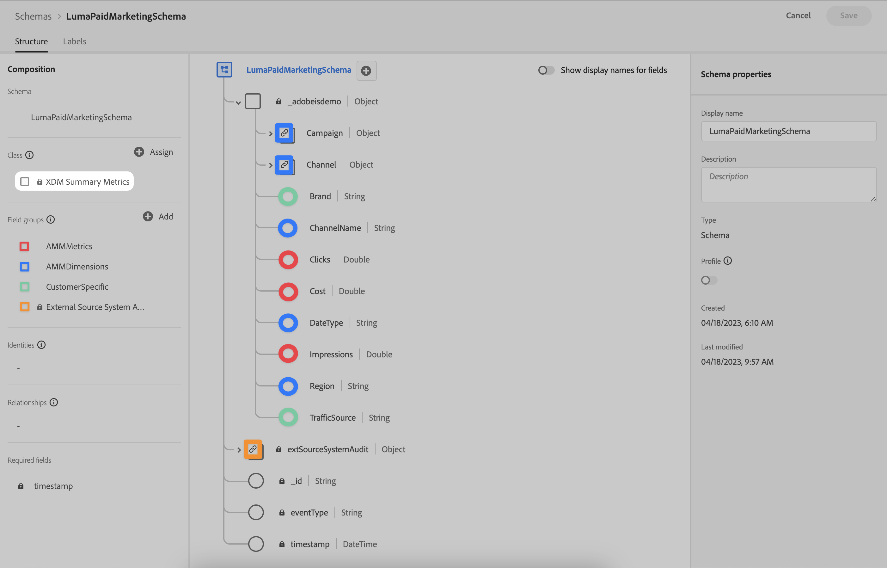

# 結構描述

若要管理結構描述，請支援您要在Adobe Experience Platform中擷取並在Adobe組合建模器中使用的資料：

1. 前往Adobe組合建模器介面。

1. 選取  **[!UICONTROL Schemas]**，底下 **[!UICONTROL DATA MANAGEMENT]**.

請參閱 [結構描述UI總覽](https://experienceleague.adobe.com/docs/experience-platform/xdm/ui/overview.html?lang=en) 以取得詳細資訊。

## 彙總或摘要資料

強烈建議使用XDM摘要量度類別，作為任何您想要擷取至Experience Platform並在Adobe混合建模程式中使用的彙總或摘要資料之基礎的結構描述。

如需範例，請參閱下文 **[!DNL LumaPaidMarketingSchema]** 將XDM摘要量度用作量度的基底類別和專用欄位群組（以顏色註釋）(**[!DNL AMMMetrics]**)，尺寸(**[!DNL AMMDimensions]**)和其他客戶特定資訊(**[!DNL CustomerSpecific]**)。

若要定義一組稽核屬性，強烈建議使用外部來源系統稽核詳細資料欄位群組，做為用於從外部來源收集彙總或摘要資料的結構描述的一部分。
