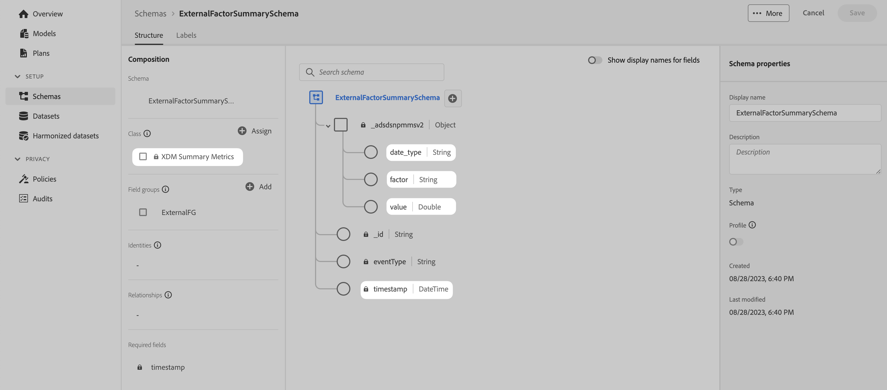

# 結構描述

若要管理結構描述，請支援您要在Adobe Experience Platform中擷取並在Adobe組合建模器中使用的資料：

1. 前往Adobe組合建模器介面。

1. 選取  **[!UICONTROL Schemas]**，底下 **[!UICONTROL DATA MANAGEMENT]**.

請參閱 [結構描述UI總覽](https://experienceleague.adobe.com/docs/experience-platform/xdm/ui/overview.html?lang=en) 以取得詳細資訊。

## 彙總或摘要資料

強烈建議使用XDM摘要量度類別，作為任何您想要擷取至Experience Platform並在Adobe混合建模程式中使用的彙總或摘要資料之基礎的結構描述。

將「XDM摘要量度」類別用於：

- 圍牆花園資料，例如Facebook或YouTube的資料。

- 外部因素資料，例如SPX （S&amp;P 500股價指數）、天氣資料、

- 內部因素資料，例如價格變更、假日行事曆。

>[!IMPORTANT]
>
>結構描述定義必須至少包含一個數值欄位（使用整數、雙精度、布林值或其他數值型別），以支援擷取資料的必要量度。

使用結構描述 **[!DNL XDM Summary Metrics]** 基底類別可以很簡單，如 **[!DNL ExternalFactorSummarySchema]** 底下。

此簡單結構描述可用於擷取包含以下資料的資料集：

- 競爭者索引資料

  | 時間戳記 | date_type | 因數 | 值 |
  |---|---|---|--:|
  | 2020-11-28T00:00:00.000盎司 | 週 | 競爭者索引 | 289.8 |
  | 2020-12-05T00:00:00.000盎司 | 週 | 競爭者索引 | 291.2 |
  | 2020-12-12T00:00:00.000盎司 | 週 | 競爭者索引 | 280.07 |
  | ... | ... | ... | ... |

- 國定假日資料

  | 時間戳記 | date_type | 因數 | 值 |
  |---|---|---|--:|
  | 2020-11-28T00:00:00.000盎司 | 週 | all_holidays_flag | 0.0 |
  | 2020-12-05T00:00:00.000盎司 | 週 | all_holidays_flag | 0.0 |
  | 2020-12-12T00:00:00.000盎司 | 週 | all_holidays_flag | 0.0 |
  | 2020-12-19T00:00:00.000盎司 | 週 | all_holidays_flag | 0.0 |
  | 2020-12-26T00:00:00.000盎司 | 週 | all_holidays_flag | 1.0 |
  | ... | ... | ... | ... |

如需更完整的範例，請參閱下文 **[!DNL LumaPaidMarketingSchema]** 使用 **[!DNL XDM Summary Metrics]** 作為基底類別。 結構描述會使用量度(**[!DNL AMMMetrics]**)，尺寸(**[!DNL AMMDimensions]**)和其他客戶特定資訊(**[!DNL CustomerSpecific]**)。

由於設定檔擷取為非同步性質，在從外部來源收集彙總或摘要資料時，建議使用外部來源系統稽核詳細資料欄位群組作為結構描述的一部分。 此欄位群組定義外部來源的一組稽核屬性。
