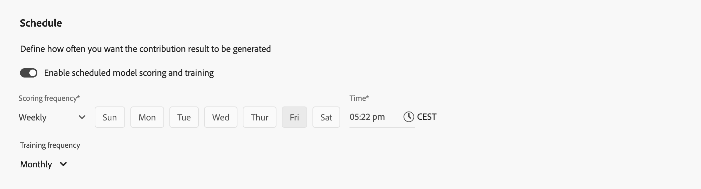

# 建立模型

為了建置您的自訂AI支援模型，介面會提供逐步引導模型設定流程。

在Mix Modeler的 **[!UICONTROL Models]**&#x200B;介面中，選取&#x200B;**[!UICONTROL Open model canvas]**。

## 設定

您在&#x200B;**[!UICONTROL Setup]**&#x200B;步驟中定義名稱和說明：

1. 輸入您的模型&#x200B;**[!UICONTROL Name]**，例如`Demo model`。 輸入&#x200B;**[!UICONTROL Description]**，例如`Demo model to explore AI featues of Mix Modeler`。

   

1. 選取&#x200B;**[!UICONTROL Next]**&#x200B;以繼續下一個步驟。 選取&#x200B;**[!UICONTROL Cancel]**&#x200B;以取消模型組態。

## 設定{#configure}

>[!CONTEXTUALHELP]
>id="model_marketingtouchpoints_select"
>title="行銷接觸點"
>abstract="行銷接觸點為收件者、個體和/或 cookie 層級的行銷事件，用於評估行銷投資對數值型或收入型轉換的影響。  您無法使用具有重疊資料的接觸點來設定模型，而且必須至少有一個具有花費的接觸點。"

您在&#x200B;**[!UICONTROL Configure]**&#x200B;步驟中設定您的模型。 設定涉及轉換目標的定義、行銷接觸點、合格的資料母體、外部和內部因素等。

1. 在&#x200B;**[!UICONTROL Conversion goal]**&#x200B;區段中：

   

   1. 從&#x200B;**[!UICONTROL Conversion]**&#x200B;下拉式功能表中選取轉換。 可用的轉換是您在[中定義為](../harmonize-data/conversions.md)轉換[!UICONTROL Harmonized datasets]一部分的轉換。 例如 **[!UICONTROL Online Conversion]**。

   1. 您可以選取 **[!UICONTROL Create a conversion]**，直接從模型組態中建立轉換。

1. 在「**[!UICONTROL Marketing touchpoints]**」區段中，您可以選取一或多個行銷接觸點，對應至您在[中定義為](../harmonize-data/marketing-touchpoints.md)行銷接觸點[!UICONTROL Harmonized datasets]一部分的行銷接觸點。

   

   1. 從&#x200B;**[!UICONTROL Touchpoint include]**&#x200B;下拉式功能表中選取一或多個行銷接觸點。

      * 您可以使用移除接觸點。
      * 您可以使用&#x200B;**[!UICONTROL Clear all]**&#x200B;移除所有接觸點。

   1. 您可以選取 **[!UICONTROL Create a touchpoint]**，以直接從模型設定中建立行銷接觸點。

   >[!NOTE]
   >
   >您無法使用具有重疊資料的接觸點來設定模型，而且必須至少有一個具有花費的接觸點。

1. 根據預設，系統會針對您協調檢視中的所有資料產生一個分數。 若要僅對母體的子集評分，請使用&#x200B;**[!UICONTROL Eligible data population]**&#x200B;區段中的容器定義一或多個篩選器。

   

   * 針對每個容器，定義一或多個事件。

      1. 針對每個事件：

         1. 從&#x200B;**[!UICONTROL _選取協調欄位_]**&#x200B;中選取量度或維度。

         1. 選取適當的運運算元： **[!UICONTROL equals]**、**[!UICONTROL not equals]**、**[!UICONTROL less than]**、**[!UICONTROL greater than]**、**[!UICONTROL starts with]**、**[!UICONTROL doesn't start with]**、**[!UICONTROL ends with]**、**[!UICONTROL doesn't end with]**、**[!UICONTROL contains]**、**[!UICONTROL doesn't contain]**、**[!UICONTROL is in]**&#x200B;或&#x200B;**[!UICONTROL is not in]**。

         1. 在&#x200B;**[!UICONTROL _輸入或選取值_]**。

      1. 若要在容器中新增其他事件，請選取 **[!UICONTROL Add event]**。

      1. 若要從容器移除事件，請選取。

      1. 若要使用容器中定義的所有或多個事件進行篩選，請選取&#x200B;**[!UICONTROL Any of]**&#x200B;或&#x200B;**[!UICONTROL All of]**。 標籤會相應地從&#x200B;**[!UICONTROL Include ... Or ...]**&#x200B;變更為&#x200B;**[!UICONTROL Include ... And ...]**。

   * 若要新增合格的資料母體容器，請選取 **[!UICONTROL Add eligible population]**。

   * 若要移除合格的資料母體容器，請在容器中選取，然後從內容功能表中選取&#x200B;**[!UICONTROL Remove marketing touchpoint]**。

   * 在容器之間選取&#x200B;**And**&#x200B;和&#x200B;**Or**，為您的合格資料母體建置更複雜的定義。

1. 若要將包含外部因子的資料集新增至模型，請在&#x200B;**[!UICONTROL External factors dataset]**&#x200B;區段中使用一或多個容器。 S&amp;P指數就是外部因素的範例。

   

   * 對於每個容器：

      1. 輸入&#x200B;**[!UICONTROL External factor name]**，例如`External Factors`。

      1. 從&#x200B;**[!UICONTROL Dataset]**&#x200B;下拉式功能表中選取資料集。 您可以選取來管理資料集。 如需詳細資訊，請參閱[資料集](../ingest-data/datasets.md)。

      1. 從&#x200B;**[!UICONTROL Impact on conversion]**&#x200B;下拉式功能表中選取選項： **[!UICONTROL Auto select]**、**[!UICONTROL Positive]**&#x200B;或&#x200B;**[!UICONTROL Negative]**。 預設選項為&#x200B;**[!UICONTROL Auto select]**，可讓模型判斷影響。 您可以覆寫預設值。

   * 若要新增其他外部因素資料集容器，請選取 **[!UICONTROL Add external factor]**。

   * 若要移除外部因子資料集容器，請選取。

1. 若要將包含內部因子的資料集新增至模型，請在&#x200B;**[!UICONTROL Internal factors dataset]**&#x200B;區段中使用一或多個容器。 電子郵件行銷資料是內部因素的範例。

   

   * 對於每個容器：

      1. 輸入&#x200B;**[!UICONTROL Internal factor name]**，例如`Email Marketing Data`。

      1. 從&#x200B;**[!UICONTROL _選取資料集_]**&#x200B;中選取資料集。 您可以選取來管理資料集。 如需詳細資訊，請參閱[資料集](../ingest-data/datasets.md)。

      1. 從&#x200B;**[!UICONTROL Impact on conversion]**&#x200B;下拉式功能表中選取選項： **[!UICONTROL Auto select]**、**[!UICONTROL Positive]**&#x200B;或&#x200B;**[!UICONTROL Negative]**。

   * 若要新增其他內部因子資料集容器，請選取 **[!UICONTROL Add internal factor]**。

   * 若要移除內部因子資料集容器，請選取。

1. 若要定義模型的回顧期間，請在`1`中輸入介於`52`到&#x200B;**[!UICONTROL Give contribution credit to touchpoints occurring within]**&#x200B;之間的值…… **[!UICONTROL weeks prior to the conversion]**。

1. 選取&#x200B;**[!UICONTROL Next]**&#x200B;以繼續下一個步驟。 如果需要更多組態，紅色外框和文字會說明需要哪些額外組態。  選取&#x200B;**[!UICONTROL Back]**&#x200B;以返回上一步。  選取&#x200B;**[!UICONTROL Cancel]**&#x200B;以取消模型組態。

## 進階

您可以在&#x200B;**[!UICONTROL Advanced]**&#x200B;步驟中指定進階設定。 在此步驟中，您可以啟用多重接觸歸因(MTA)模型。

1. 在&#x200B;**[!UICONTROL Spend share]**&#x200B;區段中：

   * 若要在行銷資料稀疏時使用歷史行銷投資比率來通知模型，請啟動&#x200B;**[!UICONTROL Allow spend share]**。 建議使用此設定，尤其是在下列情況下：
      * 管道沒有足夠的觀察值（例如支出、曝光或點按頻率低）。
      * 您正在模型化尖峰但一般且可能高花費的媒體（例如某些品牌的電視節目），這些媒體中的資料可能會很稀疏。

     >[!NOTE]
     >
     >對於一次性投資（例如超級碗廣告），請考慮將該資料納入為因素，而非依賴支出份額。
     >

1. 在&#x200B;**[!UICONTROL MTA enabled]**&#x200B;區段中：

   * 若要啟用模型的MTA功能，請啟動&#x200B;**[!UICONTROL MTA enabled]**。 如果您已啟用MTA，則在您已訓練並評分您的模型後，即可使用多重接觸歸因深入分析。 檢視[模型深入分析](insights.md#attribution)中的[歸因](insights.md)索引標籤。

1. 在&#x200B;**[!UICONTROL Prior knowledge]**&#x200B;區段中：

   

   1. 選取&#x200B;**[!UICONTROL Rule type]**，預設為&#x200B;**[!UICONTROL Absolute values]**。

   1. 使用&#x200B;**[!UICONTROL Name]**&#x200B;欄，為&#x200B;**[!UICONTROL Contribution proportion]**&#x200B;底下列出的任何管道指定貢獻百分比。

   1. 您可以視情況為每個管道新增&#x200B;**[!UICONTROL Level of confidence]**&#x200B;百分比。

   1. 必要時，請使用&#x200B;**[!UICONTROL Clear all]**&#x200B;清除&#x200B;**[!UICONTROL Contribution proportion]**&#x200B;與&#x200B;**[!UICONTROL Level of confidence]**&#x200B;欄的所有輸入值。

## 排程

您可以在&#x200B;**[!UICONTROL Schedule]**&#x200B;步驟中排程模型的訓練和計分。

1. 在&#x200B;**[!UICONTROL Schedule]**&#x200B;區段中，您可以排程模型訓練和評分。

   

   若要排程模型評分與訓練：

   1. 開啟&#x200B;**[!UICONTROL Enable scheduled model scoring and training]**。
   1. 選取&#x200B;**[!UICONTROL Scoring frequency]**：

      * **[!UICONTROL Daily]**：輸入有效時間（例如`05:22 pm`）或使用。
      * **[!UICONTROL Weekly]**：選取一週的某天，然後輸入有效的時間（例如`05:22 pm`）或使用。
      * **[!UICONTROL Monthly]**：從[Run on every]下拉式功能表中選取一個月中的某一日，然後輸入有效時間（例如`05:22 pm`）或使用。

   1. 從下拉式功能表中選取&#x200B;**[!UICONTROL Training frequency]**： **[!UICONTROL Monthly]**、**[!UICONTROL Quarterly]**、**[!UICONTROL Yearly]**&#x200B;或&#x200B;**[!UICONTROL None]**。

1. 在&#x200B;**[!UICONTROL Define training window]**&#x200B;區段中，選取：

   

   * **[!UICONTROL Have Mix Modeler select a helpful training window]**&#x200B;和

   * **[!UICONTROL Manually input a training window]**。選取時，在&#x200B;**[!UICONTROL Include events the following years prior to a conversion]**&#x200B;中定義年數。

1. 選取&#x200B;**[!UICONTROL Finish]**&#x200B;以完成您的模型設定。

   * 在&#x200B;**[!UICONTROL Create instance?]**&#x200B;對話方塊中，選取&#x200B;**[!UICONTROL Ok]**&#x200B;以立即觸發第一組訓練和評分回合。 您的模型已列出，狀態為 **[!UICONTROL Awaiting training]**。

     選取&#x200B;**[!UICONTROL Cancel]**&#x200B;以取消。

   * 如果需要更多組態，紅色外框和文字會說明需要哪些額外組態。

   選取&#x200B;**[!UICONTROL Back]**&#x200B;以返回上一步。

   選取&#x200B;**[!UICONTROL Cancel]**&#x200B;以取消模型組態。
