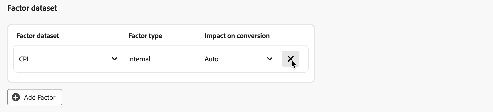
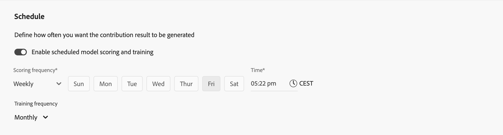

# 建立模型

為了建置您的自訂AI支援模型，介面會提供逐步引導模型設定流程。

在Mix Modeler的 **[!UICONTROL Models]**&#x200B;介面中，選取&#x200B;**[!UICONTROL Open model canvas]**。

## 設定

您在&#x200B;**[!UICONTROL Setup]**&#x200B;步驟中定義名稱和說明：

1. 輸入您的模型&#x200B;**[!UICONTROL Name]**，例如`Demo model`。 輸入&#x200B;**[!UICONTROL Description]**，例如`Demo model to explore AI features of Mix Modeler`。

   

1. 選取&#x200B;**[!UICONTROL Next]**&#x200B;以繼續下一個步驟。 選取&#x200B;**[!UICONTROL Cancel]**&#x200B;以取消模型設定。

## 設定{#configure}

>[!CONTEXTUALHELP]
>id="model_marketingtouchpoints_select"
>title="行銷接觸點"
>abstract="行銷接觸點是收件者、個體和/或 Cookie 層級的行銷事件，用於評估行銷投資對數值型或收入型轉換的影響。  您無法使用具有重疊資料的接觸點來設定模型，並且必須至少有一個接觸點有支出。"

您在&#x200B;**[!UICONTROL Configure]**&#x200B;步驟中設定您的模型。 設定涉及轉換目標的定義、行銷接觸點、合格的資料母體、外部和內部因素等。

1. 在&#x200B;**[!UICONTROL Conversion goal]**&#x200B;區段中：

   

   1. 從&#x200B;**[!UICONTROL Conversion]**&#x200B;下拉式功能表選取轉換。 可用的轉換是指您在[!UICONTROL Harmonized datasets]中定義為[轉換](../harmonize-data/conversions.md)一部分的轉換。 例如 **[!UICONTROL Online Conversion]**。

   1. 您可以選取 **[!UICONTROL Create a conversion]**，直接從模型設定中建立轉換。

1. 在&#x200B;**[!UICONTROL Marketing touchpoints]**&#x200B;區段中，您可以選取一或多個行銷接觸點，這些行銷接觸點對應到您在[!UICONTROL Harmonized datasets]中定義為[行銷接觸點](../harmonize-data/marketing-touchpoints.md)之一部分的行銷接觸點。

   

   1. 從&#x200B;**[!UICONTROL Touchpoint include]**&#x200B;下拉式功能表中選取一或多個行銷接觸點。

      * 您可以使用移除接觸點。
      * 您可以使用&#x200B;**[!UICONTROL Clear all]**&#x200B;移除所有接觸點。

   1. 您可以選取 **[!UICONTROL Create a touchpoint]**，直接從模型設定中建立行銷接觸點。

   >[!NOTE]
   >
   >您無法使用具有重疊資料的接觸點來設定模型，而且必須至少有一個具有花費的接觸點。

1. 根據預設，系統會針對您協調檢視中的所有資料產生一個分數。 若要僅對母體子集評分，請使用&#x200B;**[!UICONTROL Eligible data population]**&#x200B;區段中的容器定義一或多個篩選器。

   

   * 針對每個容器，定義一或多個事件。

      1. 針對每個事件：

         1. 從&#x200B;**[!UICONTROL _選取協調欄位_]**&#x200B;中選取量度或維度。

         1. 選取適當的運運算元： **[!UICONTROL equals]**、**[!UICONTROL not equals]**、**[!UICONTROL less than]**、**[!UICONTROL greater than]**、**[!UICONTROL starts with]**、**[!UICONTROL doesn't start with]**、**[!UICONTROL ends with]**、**[!UICONTROL doesn't end with]**、**[!UICONTROL contains]**、**[!UICONTROL doesn't contain]**、**[!UICONTROL is in]**&#x200B;或&#x200B;**[!UICONTROL is not in]**。

         1. 在&#x200B;**[!UICONTROL _輸入或選取值_]**&#x200B;輸入或選取值。

      1. 若要在容器中新增其他事件，請選取「 **[!UICONTROL Add event]**」。

      1. 若要從容器移除事件，請選取「」。

      1. 若要使用容器中定義的所有或多個事件進行篩選，請選取&#x200B;**[!UICONTROL Any of]**&#x200B;或&#x200B;**[!UICONTROL All of]**。 標籤會相應地從&#x200B;**[!UICONTROL Include ... Or ...]**&#x200B;變更為&#x200B;**[!UICONTROL Include ... And ...]**。

   * 若要新增合格的資料母體容器，請選取「 **[!UICONTROL Add eligible population]**」。

   * 若要移除合格的資料母體容器，請在容器中選取「其他，然後從內容功能表中選取「**[!UICONTROL Remove container]**」。

   * 在容器之間選取&#x200B;**與**&#x200B;和&#x200B;**或**，為您的合格資料母體建立更複雜的定義。

1. 您可以在&#x200B;**[!UICONTROL Factor dataset]**&#x200B;區段中管理包含內部或外部因素的資料集。

   

   * 若要新增因子資料集，請選取&#x200B;**[!UICONTROL Add Factor]**。 您最多可以為模型新增30個因子。

      1. 從下拉式功能表中選取&#x200B;**[!UICONTROL Factor dataset]**。 可用的因子是您已在[資料集規則](/help/harmonize-data/dataset-rules.md#create-a-dataset-rule)中定義協調欄位的因子。
根據選取的資料集，**[!UICONTROL Factor type**]為&#x200B;**[!UICONTROL Internal]**&#x200B;或&#x200B;**[!UICONTROL External]**。

      1. 從下拉式功能表中選取&#x200B;**[!UICONTROL Impact on conversion]**。 可用的選項包括： **[!UICONTROL Auto]**、**[!UICONTROL Positive]**&#x200B;或&#x200B;**[!UICONTROL Negative]**。 預設選項為&#x200B;**[!UICONTROL Auto]**，可讓模型判斷因子資料集的影響。

   * 若要刪除因子資料集，請選取。

1. 若要定義模型的回顧期間，請在&#x200B;**[!UICONTROL Give contribution credit to touchpoints occurring within]** ... **[!UICONTROL weeks prior to the conversion]**&#x200B;的&#x200B;**[!UICONTROL Define lookback window]**&#x200B;區段中輸入`1`到`52`之間的值。

1. 選取&#x200B;**[!UICONTROL Next]**&#x200B;以繼續下一個步驟。 如果需要更多組態，紅色外框和文字會說明需要哪些額外組態。 選取&#x200B;**[!UICONTROL Back]**&#x200B;以返回上一步。 選取&#x200B;**[!UICONTROL Cancel]**&#x200B;以取消模型設定。

## 進階

您可以在&#x200B;**[!UICONTROL Advanced]**&#x200B;步驟中指定進階設定。 在此步驟中，您可以啟用多重接觸點歸因(MTA)模型。

1. 在&#x200B;**[!UICONTROL Spend share]**&#x200B;區段中：

   * 若要在行銷資料稀疏時使用歷史行銷投資比率來通知模型，請啟動&#x200B;**[!UICONTROL Allow spend share]**。 建議使用此設定，尤其是在下列情況下：
      * 管道沒有足夠的觀察值（例如支出、曝光或點按頻率低）。
      * 您正在模型化尖峰但一般且可能高花費的媒體（例如某些品牌的電視節目），這些媒體中的資料可能會很稀疏。

     >[!NOTE]
     >
     >對於一次性投資（例如超級碗廣告），請考慮將該資料納入為因素，而非依賴支出份額。
     >

1. 在&#x200B;**[!UICONTROL MTA enabled]**&#x200B;區段中：

   * 若要啟用模型的MTA功能，請啟動&#x200B;**[!UICONTROL MTA enabled]**。 如果您已啟用MTA，則在您已訓練並評分您的模型後，即可使用多重接觸歸因深入分析。 檢視[模型深入分析](insights.md)中的[歸因](insights.md#attribution)索引標籤。

1. 在&#x200B;**[!UICONTROL Prior knowledge]**&#x200B;區段中：

   

   1. 選取&#x200B;**[!UICONTROL Rule type]**，預設為&#x200B;**[!UICONTROL Absolute values]**。

   1. 使用&#x200B;**[!UICONTROL Contribution proportion]**&#x200B;欄，為&#x200B;**[!UICONTROL Name]**&#x200B;底下列出的任何管道指定貢獻百分比。

   1. 您可以視情況為每個管道新增&#x200B;**[!UICONTROL Level of confidence]**&#x200B;百分比。

   1. 必要時，請使用&#x200B;**[!UICONTROL Clear all]**&#x200B;清除&#x200B;**[!UICONTROL Contribution proportion]**&#x200B;和&#x200B;**[!UICONTROL Level of confidence]**&#x200B;欄的所有輸入值。

## 設定選項

You can [schedule training and scoring](#schedule), [define training window](#training-window), and specify [granular insights reporting fields](#granular-insights-reporting-fields) for your model in the **[!UICONTROL Set options]** step.

### 排程

In the **[!UICONTROL Schedule]** section, you can schedule model training and scoring.

To scheduled model scoring and training:

1. Turn on **[!UICONTROL Enable scheduled model scoring and training]**.
1. Select a **[!UICONTROL Scoring frequency]**:

   * **[!UICONTROL Daily]**: Enter a valid time (for example `05:22 pm`) or use .
   * **[!UICONTROL Weekly]**: Select a day of the week and enter a valid time (for example `05:22 pm`) or use .
   * **[!UICONTROL Monthly]**: Select a day of the month from the Run on every dropdown menu and enter a valid time (for example `05:22 pm`) or use .

1. Select a **[!UICONTROL Training frequency]** from the dropdown menu: **[!UICONTROL Monthly]**, **[!UICONTROL Quarterly]**, **[!UICONTROL Yearly]**, or **[!UICONTROL None]**.

### Training window

In the **[!UICONTROL Define training window]** section, select between:

* **[!UICONTROL Have Mix Modeler select a helpful training window]** and

* **[!UICONTROL Manually input a training window]**. When selected, define the number of years in **[!UICONTROL Include events the following years prior to a conversion]**.

### Granular insights reporting fields

The **[!UICONTROL Granular insights reporting fields]** section uses the granular incrementality reporting functionality. This functionality allows you to select harmonized fields to breakdown conversion and touchpoint incrementality scores.

You define these harmonized fields so you can drill down in the reporting of your model using granular reporting columns instead of having to create separate models.

For example, you build a model that is focused on revenue, but you are also interested in the campaigns, media types, regions, and traffic sources performance. Without the granular incrementality reporting functionality, you would have to build four separate models. With the granular incrementality reporting functionality, you can break down your revenue model on campaigns, media types, regions, and traffic sources.

1. Select one or more harmonized fields from the **[!UICONTROL _Select harmonized fields_]** underneath **[!UICONTROL Includes]**. The selected harmonized fields are added to the panel.
1. 選取&#x200B;**[!UICONTROL *協調欄位&#x200B;*]**，從包含所選協調欄位的容器中移除協調欄位。
1. 選取&#x200B;**[!UICONTROL Clear all]**&#x200B;以移除所有選取的協調欄位。

針對精細增量報表選取的協調欄位會作為評分模型所產生的Experience Platform [結構描述](/help/ingest-data/schemas.md)和[資料集](/help/ingest-data/datasets.md)的一部分提供。 您可以在&#x200B;**[!UICONTROL conversionPassthrough]**&#x200B;和&#x200B;**[!UICONTROL touchpointPassthrough]**&#x200B;物件中找到精細的深入分析報表欄位。

針對已啟用精細增量報告的模型，在結構描述中

## 完成

* 選取&#x200B;**[!UICONTROL Finish]**&#x200B;以完成模型設定。

   * 在&#x200B;**[!UICONTROL Create instance?]**&#x200B;對話方塊中，選取&#x200B;**[!UICONTROL Ok]**&#x200B;以立即觸發第一組訓練和評分回合。 您的模型已列出，狀態為 **[!UICONTROL Awaiting training]**。

     選取&#x200B;**[!UICONTROL Cancel]**&#x200B;以取消。

   * 如果需要更多組態，紅色外框和文字會說明需要哪些額外組態。

* 選取&#x200B;**[!UICONTROL Back]**&#x200B;以返回上一步。

* 選取&#x200B;**[!UICONTROL Cancel]**&#x200B;以取消模型設定。

