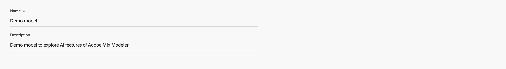
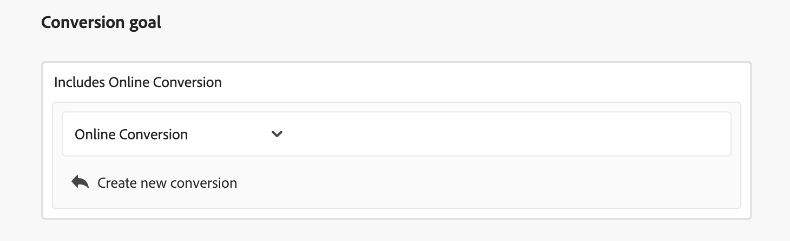
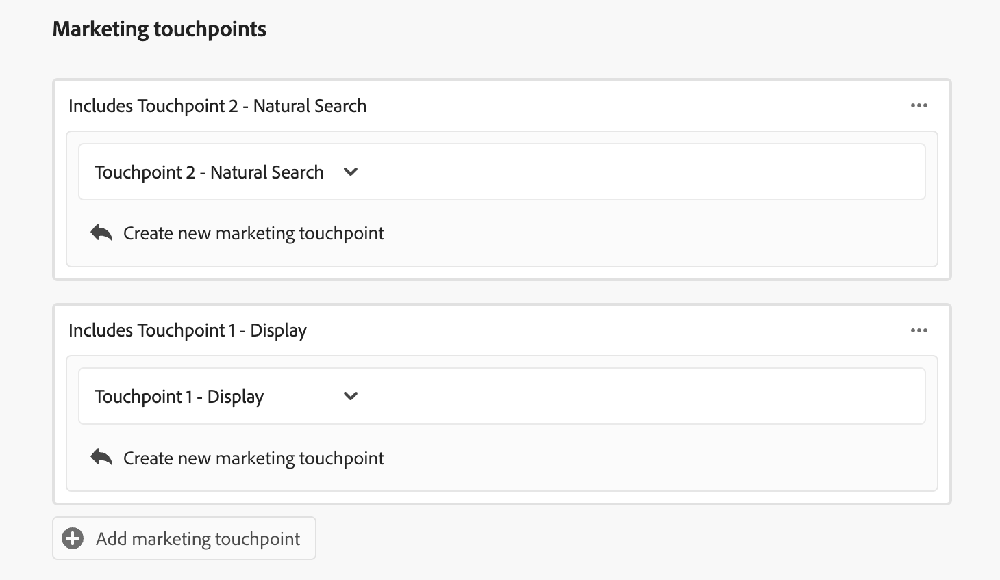
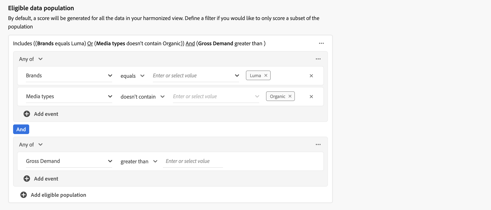
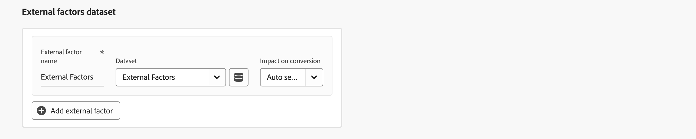
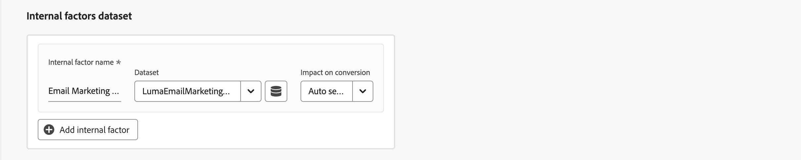
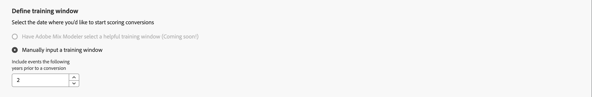
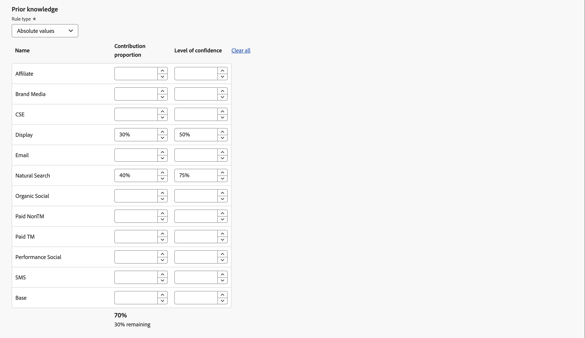

# 建立模型

若要建立模型，請在  **[!UICONTROL Models]** 介面中的Mix Modeler，選取 **[!UICONTROL Guide me]**.

為了建置您的自訂AI支援模型，介面會提供逐步引導模型設定流程。

1. 在 **[!UICONTROL Setup]** 步驟：

   1. 輸入您的模型 **[!UICONTROL Name]**，例如 `Demo model`. 輸入 **[!UICONTROL Description]**，例如 `Demo model to explore AI featues of Mix Modeler`.

      

   1. 選取 **[!UICONTROL Next]** 以繼續下一個步驟。 選取 **[!UICONTROL Cancel]** 以取消模型組態。

1. 在 **[!UICONTROL Configure]** 步驟：

   1. 在 **[!UICONTROL Conversion goal]** 區段，在容器內：

      1. 輸入 **[!UICONTROL Conversion name]** 例如，針對轉換 `Conversion`

      1. 選取轉換來源 **[!UICONTROL *選取協調欄位&#x200B;*]**，其中包含您定義為其中一部分的可用轉換 [轉換](../harmonize-data/conversions.md) 在 [!UICONTROL Harmonized datasets]. 例如&#x200B;**[!UICONTROL Online Conversion]**。

      1. 您可以選取  **[!UICONTROL Create new conversion]** 直接在模型組態中建立轉換。

         

   1. 在 **[!UICONTROL Marketing touchpoints]** 區段中，您會看到數個行銷接觸點容器，對應於您定義為其中一部分的行銷接觸點 [行銷接觸點](../harmonize-data/marketing-touchpoints.md) 在 [!UICONTROL Harmonized datasets].

      * 對於每個容器：

         1. 您可以修改 **[!UICONTROL Marketing touchpoint name]**.

         1. 選取行銷接觸點 **[!UICONTROL _選取行銷接觸點_]**.

         1. 您可以選取  **[!UICONTROL Create new marketing touchpoint]** 直接在模型設定中建立行銷接觸點。

      * 若要新增行銷接觸點容器，請選取  **[!UICONTROL Add marketing touchpoint]**.

      * 若要移除行銷接觸點容器，在容器中選取「 」  並選取 **[!UICONTROL Remove container]** 從內容功能表。

        

   1. 根據預設，系統會針對您協調檢視中的所有資料產生一個分數。 若要僅對母體的子集評分，請使用中的容器定義一或多個篩選器 **[!UICONTROL Eligible data population]** 區段。

      * 針對每個容器，定義一或多個事件。

         1. 針對每個事件：

            1. 選取量度或維度，從 **[!UICONTROL _選取協調欄位_]**.

            1. 選取適當的運運算元： **[!UICONTROL equals]**， **[!UICONTROL not equals]**， **[!UICONTROL less than]**， **[!UICONTROL greater than]**， **[!UICONTROL starts with]**， **[!UICONTROL doesn't start with]**， **[!UICONTROL ends with]**， **[!UICONTROL doesn't end with]**， **[!UICONTROL contains]**， **[!UICONTROL doesn't contain]**， **[!UICONTROL is in]**，或 **[!UICONTROL is not in]**.

            1. 在下列位置輸入或選取值： **[!UICONTROL _輸入或選取值_]**.

         1. 若要在容器中新增其他事件，請選取  **[!UICONTROL Add event]**.

         1. 若要從容器中移除事件，請選取 .

         1. 若要使用容器中定義的所有或多個事件進行篩選，請選取「 」 **[!UICONTROL Any of]** 或 **[!UICONTROL All of]**. 標籤會相應地從 **[!UICONTROL Include ... Or ...]** 至 **[!UICONTROL Include ... And ...]**.

      * 若要新增合格的資料母體容器，請選取「 」  **[!UICONTROL Add eligible population]**.

      * 若要移除合格的資料母體容器，請在容器中選取「 」  並選取 **[!UICONTROL Remove container]** 從內容功能表。

        

   1. 若要將包含外部因素的資料集新增至模型，請在以下專案中使用一或多個容器： **[!UICONTROL External factors dataset]** 區段。

      * 對於每個容器：

         1. 輸入 **[!UICONTROL Factor name]** 在 **[!UICONTROL _輸入因數_]**.

         1. 選取資料集來源 **[!UICONTROL _選取資料集_]**. 您可以選取  以管理資料集。 另請參閱 [資料集](../ingest-data/datasets.md) 以取得詳細資訊。

      * 若要新增其他外部因素資料集容器，請選取「 」  **[!UICONTROL Add external factor]**.

      * 若要移除外部因素資料集容器，請在容器中選取「 」  並選取 **[!UICONTROL Remove container]** 從內容功能表。

        

   1. 若要將包含內部因子的資料集新增至模型，請在以下專案中使用一或多個容器： **[!UICONTROL Internal factors dataset]** 區段。

      * 對於每個容器：

         1. 輸入 **[!UICONTROL Factor name]** 在 **[!UICONTROL _輸入因數_]**.

         1. 選取資料集來源 **[!UICONTROL _選取資料集_]**. 您可以選取  以管理資料集。 另請參閱 [資料集](../ingest-data/datasets.md) 以取得詳細資訊。

      * 若要新增其他內部因子資料集容器，請選取「 」  **[!UICONTROL Add internal factor]**.

      * 若要移除其他內部因子資料集容器，請在容器中選取「 」  和 **[!UICONTROL Remove container]** 從內容功能表。

        

   1. 若要定義模型的回顧視窗，請輸入介於 `1` 和 `52` 在 **[!UICONTROL Give contribution credit to touchpoints occurring within]** ... **[!UICONTROL weeks prior to the conversion]**.

   1. 選取 **[!UICONTROL Next]** 以繼續下一個步驟。 如果需要更多組態，紅色外框和文字會說明需要哪些額外組態。  選取 **[!UICONTROL Back]** 以回到上一步。  選取 **[!UICONTROL Cancel]** 以取消模型組態。

1. 在 **[!UICONTROL Advanced]** 步驟：

   1. 在 **[!UICONTROL Define training window]** 區段，選取介於

      * **[!UICONTROL Have Mix Modeler select a helpful training window]** 和

      * **[!UICONTROL Manually input a training window]**。選取時，定義年數 **[!UICONTROL Include events the following years prior to a conversion]**.

        

   1. 在 **[!UICONTROL Spend share]** 區段：

      * 若要在行銷資料稀疏時使用歷史行銷投資比率來通知模型，請啟用 **[!UICONTROL Allow spend share]**.

   1. 在 **[!UICONTROL Prior knowledge]** 區段：

      1. 選取 **[!UICONTROL Rule type]**。

      1. 為下列各色版分配百分比 **[!UICONTROL Name]**，使用 **[!UICONTROL Contribution proportion]** 欄。 確保百分比的總分佈加總為100%。

      1. 您可以為每個頻道新增 **[!UICONTROL Level of confidence]** 百分比。

      1. 需要時，使用 **[!UICONTROL Clear all]** 以清除 **[!UICONTROL Contribution proportion]** 和 **[!UICONTROL Level of confidence]** 欄。

         

1. 選取 **[!UICONTROL Finish]** 完成模型組態。

   * 在 **[!UICONTROL Create instance?]** 對話方塊，選取 **[!UICONTROL Ok]** 立即觸發第一組訓練和評分回合。 您的模型會以狀態列出 ● **[!UICONTROL Awaiting training]**。

     選取 **[!UICONTROL Cancel]** 以取消。

   * 如果需要更多組態，紅色外框和文字會說明需要哪些額外組態。

   選取 **[!UICONTROL Back]** 以回到上一步。

   選取 **[!UICONTROL Cancel]** 以取消模型組態。

