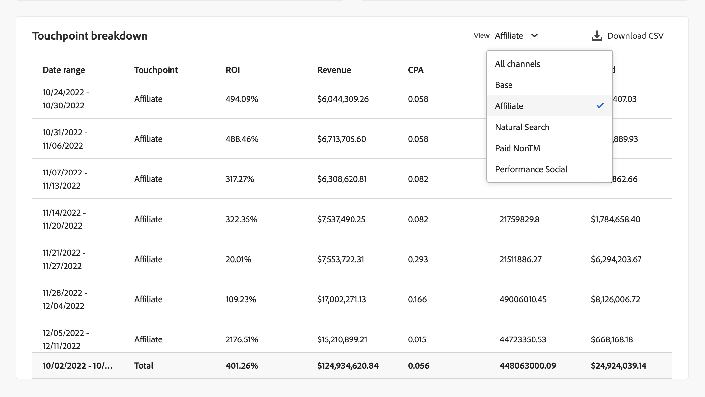

# 模型深入分析

模型深入分析中的每個視覺效果都可協助您：

* 將組織行銷活動的影響視覺化並量化。
* 識別哪些渠道表現優異。
* 確定哪些管道可能需要優化。

這些見解可協助您支援資源優先順序和配置。

若要檢視模型深入分析，請在Mix Modeler的 **[!UICONTROL Models]**&#x200B;介面中：

1. 從&#x200B;**[!UICONTROL Models]**&#x200B;表格中，選取含有●之&#x200B;**[!UICONTROL Last run status]**&#x200B;的模型名稱 **[!UICONTROL Success]**。

1. 從上下文選單中，選擇 **[!UICONTROL Model Insights]**。

可以看到上次刷新指定模型的時間，並使用四個選項卡顯示可視化效果： [模型見解](#model-insights)、 [歸因](#attribution)、 [因素](#factors)、 [診斷](#diagnostics)和 [歷史概述](#historical-overview)。

您可以變更每個標籤上的視覺效果所依據的日期時段。 輸入日期期間或選取以選取日期期間。

## [!UICONTROL Model insights]

模型深入分析索引標籤會顯示[依日期和基本媒體所區分的貢獻](#contribution-by-date-and-base-media)、[依管道所區分的貢獻](#contribution-by-channel)、[行銷績效摘要](#marketing-performance-summary)以及[邊際回應曲線](#marginal-response-curves)的視覺效果。 此索引標籤也提供[接觸點劃分](#touchppint-breakdown)表格。

* 您可以將滑鼠停留在每個視覺效果中的個別圖表元素上，以顯示包含更多詳細資訊的彈出視窗。

* 若要下載包含可視化效果數據的CSV文件，請選擇“ ”。

* 若要在 Excel 格式中下載完整的模型見解數據Microsoft®請選擇“**[!UICONTROL Download data]**”。

### 依日期和基本媒體所區分的貢獻。

此棧疊圖表視覺效果的順序如下：

* 底部的。
* 非支出管道位於中間。
* 優先消費管道。

此視覺效果代表在某個日期範圍內由基礎、支出管道和非支出管道所實現的貢獻比例。 此視覺效果有助於展示遞增性。 基底代表在沒有任何行銷的情況下會發生什麼情況，而非支出管道加上支出管道（在基底之上）歸因於行銷的影響。 簡言之，非支出加支出等於行銷工作的累加影響，而視覺效果可讓insight輕鬆瞭解行銷產生的價值。

### 依據管道的貢獻

顯示不同管道貢獻分佈的環形圖視覺效果。 此視覺效果透過前三個執行管道的鏡頭（不包括基底和&#x200B;*所有其他*&#x200B;類別）以增量方式展示。 視覺效果有助於支援優先順序和預算分配。

### 行銷績效摘要。

水平條狀圖可視化效果，顯示每個渠道的ROI或CPA性能。 此可視化突出顯示了您行銷投資的ROI/CPA。 頻道根據ROI/CPA按降序排列。 可視化有助於識別哪些管道最有效，哪些可能需要優化。

### 邊際回應曲線。

折線圖可視化並比較了行銷管道投資產生的邊際回報。  並確定增量回報低於增量支出的收支平衡點。 因此，此可視化可説明您瞭解行銷投資何時開始變得不那麼有效。

曲線、收支平衡點和相應值是根據所選數據範圍和所選通道計算的。

若要變更通道：

* 從下拉功能表中 **[!UICONTROL Channel]** 選取通道以更新特定通道的視覺化。

### 接觸點劃分

接觸點劃分表每周顯示所有或選定管道的每周接觸點細分，並顯示與每個渠道關聯的關鍵量度。 該表允許您在更精細的通道級別輕鬆比較、識別趨勢和跟蹤效果。 此表格明確補充[依日期和基本媒體所區分的貢獻](#contribution-by-date-and-base-media)視覺效果和[依管道所區分的貢獻](#contribution-by-channel)視覺效果。

下列欄可供使用：

| 欄 | 說明 |
|---|---|
| **[!UICONTROL Date range]** | 要報告的周。 |
| **[!UICONTROL Touchpoint]** | 具體接觸點通道。 |
| **[!UICONTROL ROI]** | （**[!UICONTROL Revenue]** - **[!UICONTROL Spend]**） / **[!UICONTROL Spend]**&#x200B;的百分比。 |
| **[!UICONTROL Revenue]** | 日期範圍的收入。 |
| **[!UICONTROL CPA]** | **[!UICONTROL Spend]** / **[!UICONTROL Conversions]**。 |
| **[!UICONTROL Conversions]** | 日期範圍的轉換。 |
| **[!UICONTROL Spend]** | 數據範圍的花費。 |

要選擇特定通道或所有管道，請從下拉功能表中進行選擇 **[!UICONTROL View]** 。

若要下載“接觸點”劃分表的內容，請選擇“下載](/help/assets/icons/Download.svg)**[!UICONTROL Download CSV]**”。![

## **[!UICONTROL Factors]**[!BADGE &#x200B;試用版]

「因素 [!BADGE 」標籤] 显示外部因素相關見解。

此視覺效果可協助您瞭解各種內部和外部因素對轉換基準線的累加影響。 例如，經濟條件或促銷活動。

使用&#x200B;**[!UICONTROL Factors]**&#x200B;下拉式功能表來選取您要顯示的因素。

<!-- need to update the image when we do have a proper example -->

若要下載包含資料表資料的CSV檔案，請選取。

如果沒有可用的資料，您會看到訊息 **[!UICONTROL No data is available, you may need to retrain your model, or change the date range to view insights]**。

## [!UICONTROL Attribution]

>[!NOTE]
>
>「歸因」索引標籤僅適用於啟用MTA的模型。

[!UICONTROL Attribution]使用此標籤，您可以了解具有事件層級数据的接觸點和行銷廣告系列的效果。請參閱[建置模型](build.md)。

支援下列歸因模型：

* 根據Mix Modeler中選取的模型：
   * 演演算法 — 受影響的
   * 演演算法 — 遞增式
* 基於規則：
   * 衰減單位
   * 首次接觸
   * 上次接觸
   * 線性
   * U形

如需Mix Modeler中多重接觸歸因功能的簡介，請參閱[多重接觸歸因](../get-started/about.md#multi-touch-attribution)。

從&#x200B;**[!UICONTROL Attribution Model]**&#x200B;下拉式功能表中選取一或多個歸因模型。 所選的歸因模型會套用至「歸因」標籤中的所有視覺效果。

Mix建模器多點觸控歸因精細事件分數與整體Mix建模器分數和投資回報率一致。 這些分數也以Experience Platform中的數據集形式提供。

「歸因」標籤包含下列視覺效果：

### [!UICONTROL Overview]

[!UICONTROL Overview]視覺效果會顯示所選歸因模型的轉換總計和百分比。 選取更多模型後，視覺效果中會新增其他圓圈，每個圓圈都有各自對應圖例的顏色。

若要檢視包含歸因模型詳細資訊的快顯視窗，請將滑鼠移到視覺效果中的任何圓圈上。

### [!UICONTROL Trends]

[!UICONTROL Daily trends]、[!UICONTROL Weekly trends]或[!UICONTROL Monthly trends]視覺效果會顯示所選歸因模型的每日、每週或每月轉換趨勢。

要選擇期間，請選擇 **[!UICONTROL Daily trends]**&#x200B;或 **[!UICONTROL Weekly trends]** **[!UICONTROL Monthly trends]**&#x200B;更多。

若要檢視詳細資訊，請將滑鼠停留在特定歸因模型的資料行上，以顯示顯示該資料轉換總數的彈出視窗。

### [!UICONTROL Breakdown]

[!UICONTROL Breakdown]視覺效果是每個所選歸因模型轉換的劃分管道或接觸點。 此視覺效果有助於決定每個頻道或接觸點的成效。

若要選擇劃分型別，請從中選取&#x200B;**[!UICONTROL Breakdown by channel]**&#x200B;或&#x200B;**[!UICONTROL Breakdown by touchpoint]**。

若要檢視詳細資訊，請將滑鼠游標停留在任何圖表元素上。

### [!UICONTROL Top campaigns]

熱門促銷活動視覺效果會顯示熱門促銷活動表格，其中包含「促銷活動名稱」、「頻道」、「媒體型別」和「遞增式轉換」欄。 此可視化可以幫助您團隊了解特定行銷活動對給定通道的有效性，並提供有關您應該進一步投資哪些廣告系列的見解。

要按頻道、媒體類型或增量轉換的升序 ↑ 或降序 ↓ 對表格進行排序，請選擇列標題並切換排序。

若要在單獨的對話框中展開表，請從「更多」](/help/assets/icons/More.svg)中進行選擇&#x200B;**[!UICONTROL Expand]**![。

展開的熱門廣告系列對話框會顯示相同的表格以及額外的欄位：

* 增量轉換
* 影響的轉換
* 首次接觸轉換
* 上次接觸轉換

  您可以選取每個額外的欄標題，以遞增或遞減順序排序表格。

若要關閉展開的[熱門促銷活動]對話方塊，請選取&#x200B;**[!UICONTROL Close]**。

### [!UICONTROL Breakdown by touchpoint position]

[!UICONTROL Breakdown by touchpoint position]視覺效果是依據所有轉換路徑上的接觸點和接觸點的位置劃分已歸因的轉換。 此圖表可協助您比較某個接觸點在某個位置的貢獻是否優於其他位置和其他任何位置的接觸點。

>[!NOTE]
>
>歸因模型在所有接觸點和位置的貢獻百分比總和應等於100。

位置[!UICONTROL Starter]、[!UICONTROL Player]和[!UICONTROL Closer]的定義如下：

| 位置 | 說明 |
|---|---|
| [!UICONTROL Starter] | 此位置會指出該接觸點是否為轉換路徑中的首次接觸。 |
| [!UICONTROL Player] | 此位置表示接觸點不是導致轉換的第一次或最後一次接觸。 |
| [!UICONTROL Closer] | 此位置可指出接觸點是否為轉換前的最後一次接觸。 |

### [!UICONTROL Top conversion paths]

視覺效果會顯示 [!UICONTROL Top conversion paths] 根據選取歸因模型的前 5 個轉換路徑。

對於每個轉換路徑，您會看到：

* 確實有影響的渠道數量，
* 歸因路徑總數，
* 此轉換路徑的屬性化路徑占屬性路徑總數的百分比，
* 對於每個通道，歸因模型貢獻百分比，以及
* 這些通道的總和歸因模型貢獻百分比。

## [!UICONTROL Diagnostics]

診斷標籤顯示以下各項的可視化效果：

* [!UICONTROL Model Assessment] 視覺效果，您可以根據「實際與預測」或「殘餘」轉換進行劃分。

  若要劃分視覺效果，請從&#x200B;**[!UICONTROL Breakdown]**&#x200B;清單中選取&#x200B;**[!UICONTROL Actual vs. Predicted]**&#x200B;或&#x200B;**[!UICONTROL Residuals]**。

* [!UICONTROL Model fitting metrics]資料表，顯示每個轉換量度的下列資料行：

   * 實際轉換

   * 模型化轉換

   * 剩餘轉換（實際轉換與模型化轉換之間的差異）

   * 模型品質分數值：

      * R2（R 平方），它指示數據與回歸模型的擬合優度（擬合優度）。

      * MAPE（平均絕對百分比 錯誤），它是最常用的 KPI 之一，用於測量預測準確性，並將預測誤差表示為實際值的百分比。

      * RMSE （均方根誤差）：顯示平均誤差，根據誤差的平方加權。

  若要下載包含資料表資料的CSV檔案，請選取。

* [!UICONTROL Touchpoint effectiveness]表格，代表Attribution AI演演算法模型的結果。 只會針對特定時段產生此資料表的資料。 選取 **[!UICONTROL As of *xx/xx/xx， xx：xx TZ *]** 以瞭解詳細資訊。

  視覺效果會以遞減順序](/help/assets/icons/SortOrderDown.svg)遞[!UICONTROL Efficiency measure]![減順序顯示每個接觸點：

   * [!UICONTROL Paths touched]：可視化實現轉換的路徑百分比和未達到轉換的路徑百分比。 對於接觸點，當歸因轉換比例較高時，您會看到更多歸因轉化。 此比率比較了銷售機會為轉換的路徑的百分比與未&#x200B;**&#x200B;銷售機會為轉換的路徑的百分比。
   * [!UICONTROL Efficiency measure]：由演演算法歸因模型產生，效率測量表示某個接觸點對轉換的相對重要性，與接觸點數量無關。 效率是以1到5的級數來衡量。 請注意，接觸點數量越多並不保證測量效率越高。
   * [!UICONTROL Total volume]：使用者接觸接觸點的彙總次數。 數目包括出現在達成轉換的路徑上的接觸點，以及導致轉換的路徑&#x200B;*not*。

## [!UICONTROL Historical overview]

「歷史概述」標籤顯示下列專案的視覺效果：

### 按會計季和產品劃分的轉換和支出

此視覺效果代表指定日期範圍內各個季度的轉換和支出分佈。 此視覺效果有助於識別支出帶動轉換的高成效季度。

### 依據管道的支出

此視覺效果代表指定日期範圍內各種管道的支出分佈。 視覺效果可支援快速識別哪些管道收到最多支出。

### 接觸點支出

此視覺效果代表指定日期範圍內每個季度各付費接觸點的支出分佈。 此視覺效果可讓您瞭解哪些接觸點在特定管道和季度內有優先順序。 視覺效果有助於識別管道支出模式和趨勢，尤其是低支出、不常發生的管道。

若要選取要針對此視覺效果顯示的其他以花費為基礎的通道：

* 從 **[!UICONTROL Channels]**&#x200B;中選擇通道。

### 接觸點音量

此視覺效果代表指定日期範圍內每個季度所有接觸點的數量分布情況。

若要選取要為此視覺效果顯示的替代的基於體積的通道：

* 從&#x200B;**[!UICONTROL Channels]**&#x200B;中選取頻道。

## **[!UICONTROL Edit]**

您可以編輯模型的名稱、說明，以及訓練和評分的排程。

1. 選取編輯

1. 在&#x200B;**[!UICONTROL Edit model]**&#x200B;對話方塊：

   * 輸入新的&#x200B;**[!UICONTROL Name]**&#x200B;和&#x200B;**[!UICONTROL Description]**。

   * 若要啟用排程，請啟用&#x200B;**[!UICONTROL Status]**。 您只能為已訓練和評分的模型啟用排程。

      1. 選取&#x200B;**[!UICONTROL Scoring frequency]**：

         * **[!UICONTROL Daily]**：輸入有效時間（例如`05:22 pm`）或使用。
         * **[!UICONTROL Weekly]**：選取一週的某天，然後輸入有效的時間（例如`05:22 pm`）或使用。
         * **[!UICONTROL Monthly]**：從[Run on every]下拉式功能表中選取一個月中的某一日，然後輸入有效時間（例如`05:22 pm`）或使用。

      1. 從下拉式功能表中選取&#x200B;**[!UICONTROL Training frequency]**： **[!UICONTROL Monthly]**、**[!UICONTROL Quarterly]**、**[!UICONTROL Yearly]**&#x200B;或&#x200B;**[!UICONTROL None]**。

     

1. 選擇「**[!UICONTROL Save]**」。
