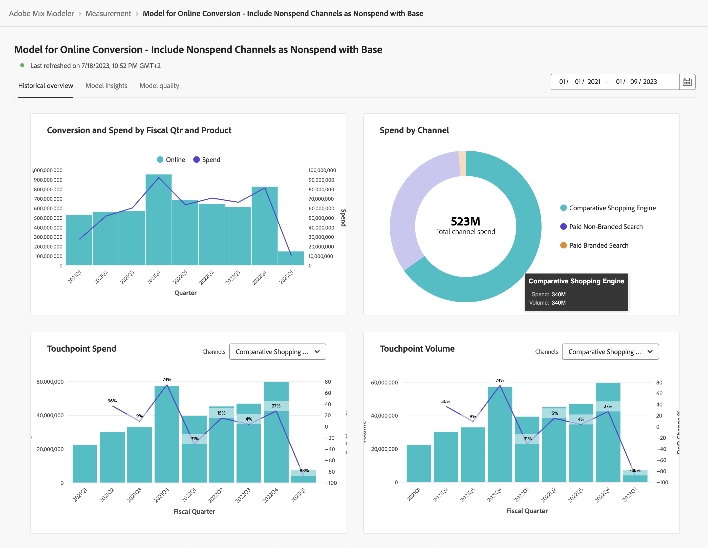
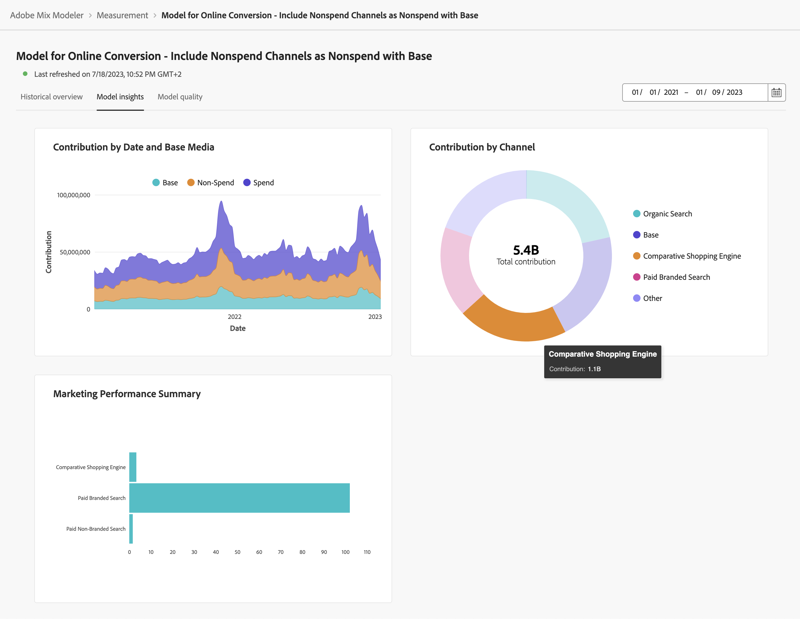

# 模型深入分析

若要檢視模型深入分析，請在  **[!UICONTROL Models]** Adobe組合建模器中的介面：

1. 選取模型名稱，其中包含 **[!UICONTROL Last run status]** 之 ● **[!UICONTROL Success]** 從 **[!UICONTROL Models]** 表格。

1. 從內容功能表中，選取 **[!UICONTROL Model Insights]**.

您會看到指定模型的上次重新整理時間，而Widget會使用三個標籤顯示：歷史總覽、模型深入分析和模型品質。

您可以變更每個標籤上Widget所根據的日期期間。 輸入日期期間或選取  以選取日期期間。

## 歷史總覽

「歷史總覽」索引標籤顯示以下專案的Widget：

* 依會計季度和產品劃分的轉換與支出

* 依據管道的支出

* 接觸點支出

  您可以為此Widget選取要顯示的替代支出型管道。 從以下來源選取管道： **[!UICONTROL Channels]**.

* 接觸點數量

  您可以為此Widget選取要顯示的替代磁碟區型通道。 從以下來源選取管道： **[!UICONTROL Channels]**.

## 模型深入分析

「模型深入分析」標籤會顯示以下專案的Widget：

* 依日期和基本媒體所區分的貢獻

* 依據管道的貢獻

* 行銷績效摘要

您可以將滑鼠停留在每個Widget中的個別圖表元素上，以檢視包含更多詳細資訊的彈出視窗。

## 模型品質

「模型品質」標籤會顯示用於測量的Widget：

* R2 （R平方），表示資料符合回歸模型的程度（符合的程度）。

* MAPE （平均絕對誤差百分比），這是最常用來測量預測準確度的KPI之一，並以實際值的百分比表示預測誤差。

* RMSE （均方根誤差）：顯示平均「誤差」，根據誤差的平方加權。

