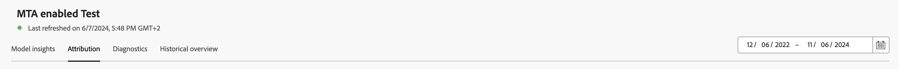
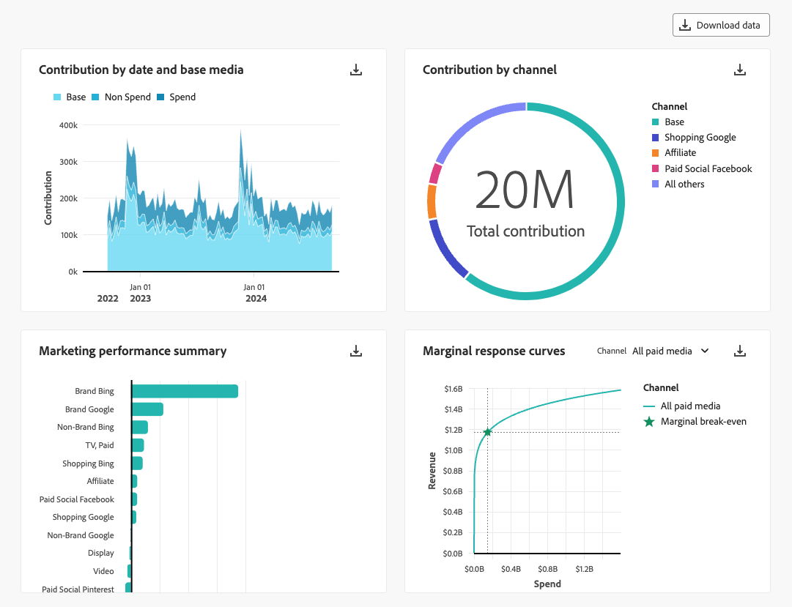
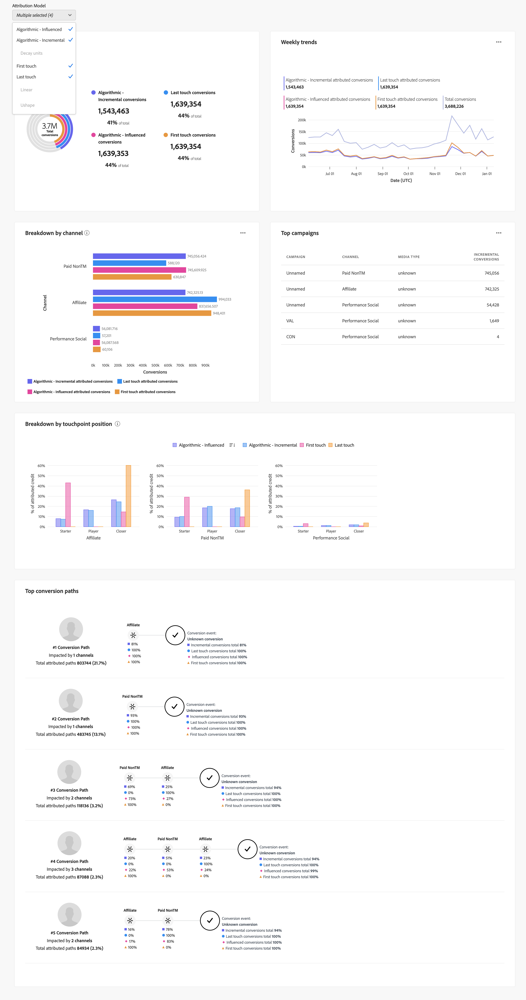
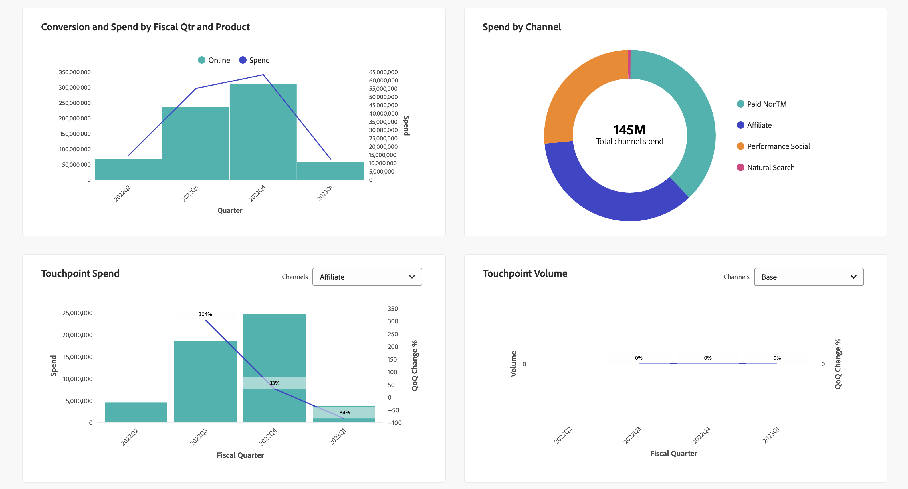

# 模型深入分析

若要檢視模型深入分析，請在  **[!UICONTROL Models]** Mix Modeler介面：

1. 從 **[!UICONTROL Models]** 表格中，選取具有 **[!UICONTROL Last run status]** 之 ● **[!UICONTROL Success]**。

1. 從內容功能表中，選取 **[!UICONTROL Model Insights]**.

您會看到指定模型的上次重新整理時間，且會使用四個標籤來顯示Widget： [模型深入分析](#model-insights)， [歸因](#attribution)， [診斷](#diagnostics)、和 [歷史總覽](#historical-overview).

您可以變更每個標籤上Widget所根據的日期期間。 輸入日期期間或選取  以選取日期期間。

## [!UICONTROL Model insights]

「模型深入分析」標籤會顯示以下專案的Widget：

* 依日期和基本媒體所區分的貢獻。 棧疊圖表有序：底部為基底、中間為非支出管道、頂端為支出管道。

* 依據管道的貢獻。

* 行銷績效摘要。

* 邊際回應曲線。
   從中選擇頻道 **[!UICONTROL Channel]** 更新特定管道Widget的下拉式清單。

您可以將滑鼠停留在每個介面工具集中的個別圖表元素上，以顯示包含更多詳細資訊的彈出視窗。

若要下載包含Widget資料的CSV檔案，請選取 .

若要以Microsoft® Excel格式下載完整的模型分析資料，請選取  **[!UICONTROL Download data]**.

## [!UICONTROL Attribution]

使用 [!UICONTROL Attribution] 索引標籤上，您可以瞭解擁有事件層級資料的接觸點和行銷活動的有效性。 支援下列歸因模型：

* 根據Mix Modeler中選取的模型：
   * 演演算法 — 受影響的
   * 演演算法 — 遞增式
* 以規則為基礎：
   * 衰減單位
   * 首次接觸
   * 上次接觸
   * 線性
   * U形

另請參閱 [多重接觸歸因](../get-started/about.md#multi-touch-attribution) 以瞭解Mix Modeler的多點觸控歸因功能。

從以下專案選取一或多個歸因模型： **[!UICONTROL Attribution Model]** 下拉式清單。 所選的歸因模型會套用至「歸因」標籤中的所有小工具。

Mix Modeler的多點接觸歸因精細事件分數會與整體Mix Modeler分數和ROI相符。 這些分數也可作為Experience Platform中的資料集使用。

「歸因」標籤包含下列介面工具集：

### [!UICONTROL Overview]

此 [!UICONTROL Overview] widget會針對選取的歸因模型顯示轉換總計和百分比。 選取更多模型後，視覺效果中會新增其他圓圈，每個圓圈都有各自對應圖例的顏色。

若要檢視包含歸因模型詳細資訊的快顯視窗，請將滑鼠移到視覺效果中的任何圓圈上。

### [!UICONTROL Trends]

此 [!UICONTROL Daily trends]， [!UICONTROL Weekly trends]，或 [!UICONTROL Monthly trends] widget會顯示所選歸因模型的每日、每週或每月轉換趨勢。

若要選擇期間，請選取 **[!UICONTROL Daily trends]**， **[!UICONTROL Weekly trends]** 或 **[!UICONTROL Monthly trends]** 從 .

若要檢視詳細資訊，請將滑鼠停留在特定歸因模型的資料行上，以顯示顯示該資料轉換總數的彈出視窗。

### [!UICONTROL Breakdown]

此 [!UICONTROL Breakdown] widget是每個所選歸因模型轉換的劃分管道/接觸點。 此Widget可協助您針對每個管道或接觸點的有效性做出決策。

若要選擇劃分型別，請選取「 」 **[!UICONTROL Breakdown by channel]** 或 **[!UICONTROL Breakdown by touchpoint]** 從 .

若要檢視詳細資訊，請將滑鼠游標停留在任何圖表元素上。

### [!UICONTROL Top campaigns]

排名最前的行銷活動Widget會顯示排名最前的行銷活動表格，其中包含「行銷活動名稱」、「頻道」、「媒體型別」和「遞增轉換」欄。 此Widget可協助您的團隊瞭解特定頻道特定行銷活動的效益，並提供您應進一步投資哪些行銷活動的深入分析。

若要針對「頻道」、「媒體型別」或「遞增轉換」↓以遞增↑或遞減順序來排序表格，請選取欄標題並切換排序。

若要展開個別對話方塊中的表格，請選取 **[!UICONTROL Expand]** 從 .

展開的「熱門促銷活動」對話方塊會顯示相同的表格，其中包含下列專案的額外欄

* 增量轉換
* 受影響的轉換
* 首次接觸轉換
* 上次接觸轉換

  您可以選取每個額外的欄標題，以遞增或遞減順序排序表格。

若要關閉展開的「熱門促銷活動」對話方塊，請選取「 」 **[!UICONTROL Close]**.

### [!UICONTROL Breakdown by touchpoint position]

此 [!UICONTROL Breakdown by touchpoint position] 視覺效果是依據所有轉換路徑上的接觸點和接觸點的位置劃分已歸因的轉換。 此圖表可協助您比較某個接觸點在某個位置的貢獻是否優於其他位置和其他任何位置的接觸點。

>[!NOTE]
>
>歸因模型在所有接觸點和位置的貢獻百分比總和應等於100。

位置 [!UICONTROL Starter]， [!UICONTROL Player] 和 [!UICONTROL Closer] 定義如下：

| 位置 | 說明 |
|---|---|
| [!UICONTROL Starter] | 此位置會指出該接觸點是否為轉換路徑中的首次接觸。 |
| [!UICONTROL Player] | 此位置指出接觸點是否不是導致轉換的第一次或最後一次接觸。 |
| [!UICONTROL Closer] | 此位置會指出該接觸點是否為轉換前的最後一次接觸。 |

### [!UICONTROL Top conversion paths]

此 [!UICONTROL Top conversion paths] 視覺效果會根據選取的歸因模型顯示前5個轉換路徑。

對於每個轉換路徑，您會看到：

* 確實有影響的管道數，
* 已歸因的路徑總數，
* 此轉換路徑的已歸因路徑與已歸因路徑總數的百分比，
* 每個管道的歸因模型貢獻百分比，以及
* 這些管道歸因模型貢獻百分比的總和。

## [!UICONTROL Diagnostics]

「診斷」標籤顯示以下專案的Widget：

* [!UICONTROL Model Assessment] 視覺效果，您可根據「實際」與「預計」或「剩餘」轉換劃分視覺效果。

  若要劃分視覺效果，請選取 **[!UICONTROL Actual vs. Predicted]** 或 **[!UICONTROL Residuals]** 從 **[!UICONTROL Breakdown]** 清單。

* [!UICONTROL Model fitting metrics] 表格，針對每個轉換量度顯示下列欄：

   * 實際轉換

   * 模型化轉換

   * 剩餘轉換（實際轉換與模型化轉換之間的差異）

   * 模型品質分數值：

      * R2 （R平方），表示資料符合回歸模型的程度（符合的程度）。

      * MAPE （平均絕對誤差百分比），這是最常用來測量預測準確度的KPI之一，並以實際值的百分比表示預測誤差。

      * RMSE （均方根誤差）：顯示平均誤差，根據誤差的平方加權。

  若要下載包含表格資料的CSV檔案，請選取 .

* [!UICONTROL Touchpoint effectiveness] 表格，代表Attribution AI演演算法模型的結果。 只會針對特定時段產生此資料表的資料。 選取 **[!UICONTROL As of *xx/xx/xx， xx：xx TZ *]** 以取得更多詳細資料。

  此視覺效果會依降序顯示 [!UICONTROL Efficiency measure] ，適用於每個接觸點：

   * [!UICONTROL Paths touched]：將達成轉換的路徑百分比與未達成轉換的路徑百分比視覺化。 對於接觸點，當歸因轉換比率很高時，您會看到更多歸因轉換。 此比率會比較帶來轉換的路徑百分比與帶來轉換的路徑百分比 *非* 導致轉換。
   * [!UICONTROL Efficiency measure]：由演演算法歸因模型產生，效率測量表示接觸點對轉換的相對重要性，與接觸點數量無關。 效率是以1到5的級數來衡量。 請注意，接觸點數量越多並不保證測量效率越高。
   * [!UICONTROL Total volume]：使用者接觸接觸點的彙總次數。 數字包含出現在達成轉換的路徑上的接觸點以及路徑 *非* 進而產生轉換。

## [!UICONTROL Historical overview]

「歷史總覽」索引標籤顯示以下專案的Widget：

* 依會計季度和產品劃分的轉換與支出。

* 依據管道的支出。

* 接觸點支出。

  您可以為此Widget選取要顯示的替代支出型管道。 從以下來源選取管道： **[!UICONTROL Channels]**.

* 接觸點數量。

  您可以為此Widget選取要顯示的替代磁碟區型通道。 從以下來源選取管道： **[!UICONTROL Channels]**.

