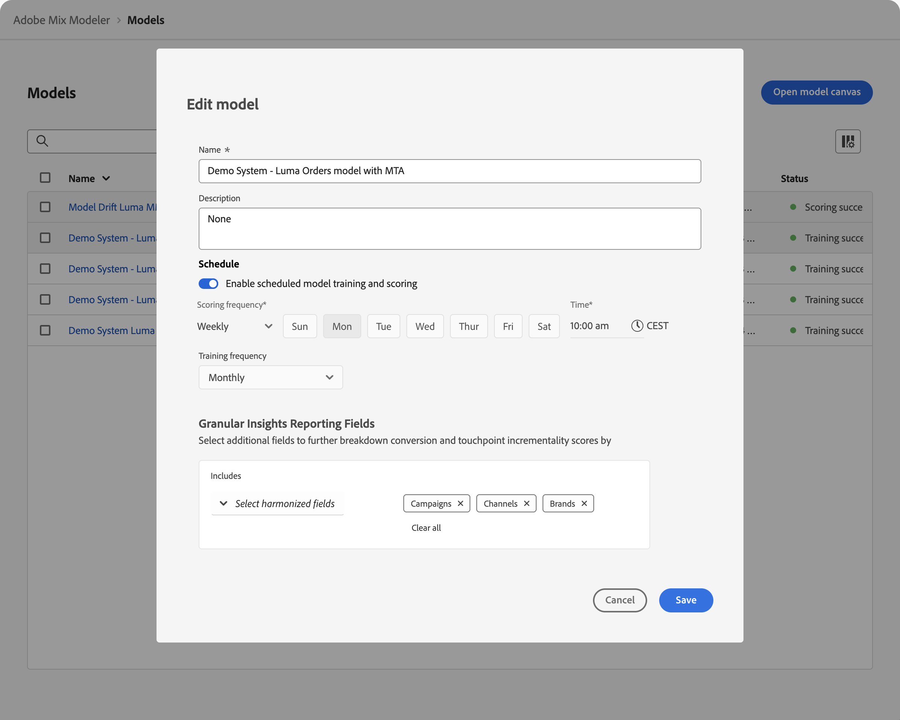
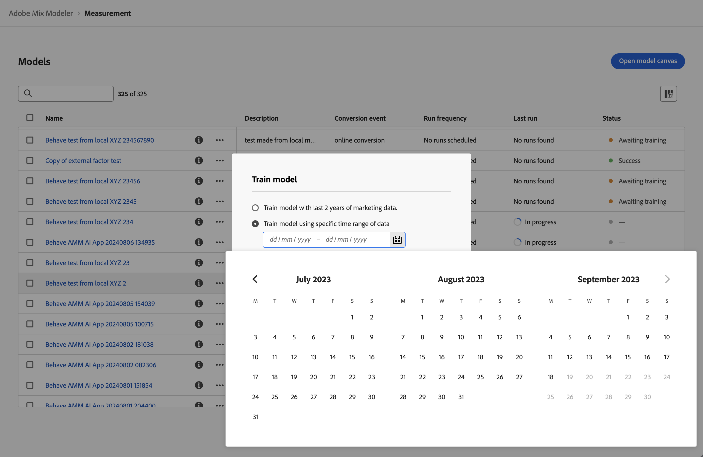
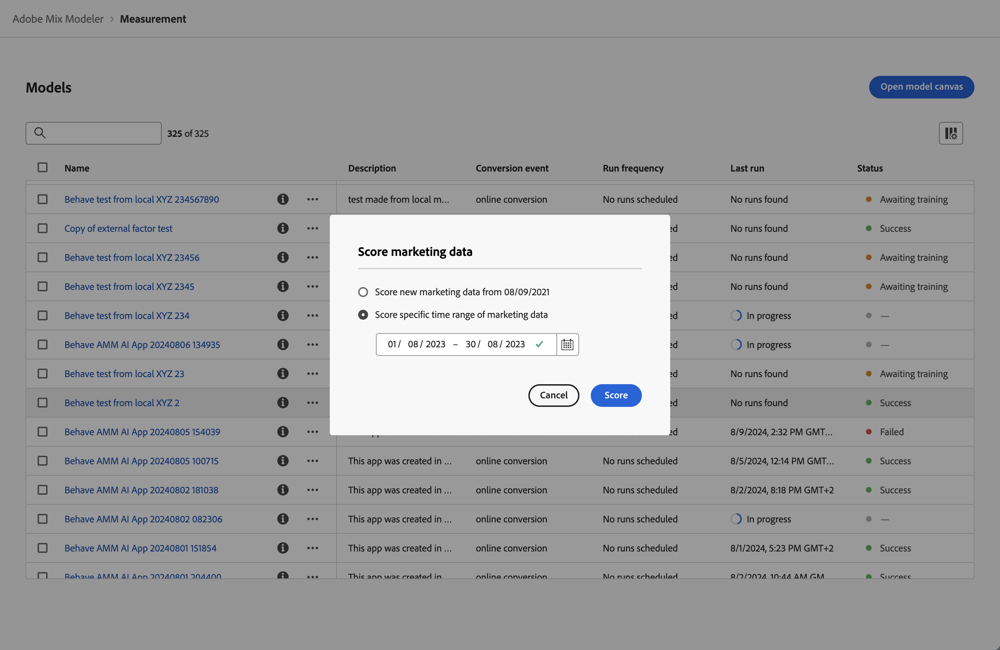

# 模型

Mix Modeler中的模型功能可讓您設定、訓練業務目標特定的模型，並為其評分。 訓練和評分可支援AI驅動的多點觸控歸因與行銷組合模型化之間的轉移學習。

這些模型以您在Mix Modeler應用程式工作流程中建立的協調資料為基礎。

Mix Modeler中的模型是一種機器學習模型，用於根據行銷人員的投資來測量及預測指定的結果。 行銷接觸點和摘要層級資料可作為輸入使用。 Mix Modeler可讓您根據不同的變數集、維度和結果（例如收入、銷售量、銷售機會）建立模型的變體。

模型需要：

* 一次轉換。
* 一或多個行銷接觸點（管道）由摘要層級的資料、行銷接觸點資料（事件資料）或兩者組成。
* 可設定的回顧期間。
* 可設定的訓練視窗。

模型可選擇包括：

* 外部因素。
* 內部因素。
* 先前瞭解其他來源的行銷貢獻，例如過去的利害關係人經驗、逐步測試、其他模型。
* 支出份額，在行銷資料稀疏時，使用相對支出份額作為代理。

## 建立模型

若要建立模型，請使用選取&#x200B;**[!UICONTROL Open model canvas]**&#x200B;時可用的Mix Modeler逐步引導模型組態流程。 如需詳細資訊，請參閱[建立模型](create.md)。

## 管理模型

若要檢視目前模型的表格，請在Mix Modeler介面中：

1. 從左側邊欄選取 **[!UICONTROL Models]**。

1. 您會看到目前模型的表格。

   表格欄指定模型的詳細資訊。

   | 欄名稱 | 詳細資料 |
   |---|---|
   | 名稱 | 模型名稱 |
   | 說明 | 模型說明 |
   | 轉換事件 | 您為模型選取的轉換。 |
   | 執行頻率 | 訓練模型的執行頻率。 |
   | 上次執行 | 模型上次培訓的日期和時間。 |
   | 狀態 | 模型訓練上次執行的狀態。  成功 訓練問題  正在等待訓練 失敗  _ （上次執行正在進行時） |

   {style="table-layout:auto"}

1. 若要變更為清單顯示的欄，請選取，並開啟或關閉欄。

您可以對特定模型執行下列動作。

### 模型深入分析

模型深入分析功能僅適用於訓練成功且已評分的模型。

若要檢視模型的深入分析：

1. 從左側邊欄選取 **[!UICONTROL Models]**。

1. 選取模型名稱。

您被重新導向至[模型深入分析](insights.md)。

### 檢視詳細資料

若要檢視模型的詳細資訊：

1. 從左側邊欄選取 **[!UICONTROL Models]**。

1. 選取模型的，以顯示包含詳細資訊的快顯視窗。

### 複製

您可以快速複製模型。

1. 從左側邊欄選取 **[!UICONTROL Models]**。

1. 為模型選取，然後從內容功能表選取&#x200B;**[!UICONTROL Duplicate]**。

### 編輯

您可以編輯模型的名稱、說明，以及訓練和評分的排程。

1. 從左側邊欄選取 **[!UICONTROL Models]**。

1. 為模型選取，然後從內容功能表選取&#x200B;**[!UICONTROL Edit]**。

   在&#x200B;**[!UICONTROL Edit model]**&#x200B;對話方塊：

   * 輸入新的&#x200B;**[!UICONTROL Name]**&#x200B;和&#x200B;**[!UICONTROL Description]**。

   * 若要啟用排程，請啟用&#x200B;**[!UICONTROL Status]**。 您只能為已訓練和評分的模型啟用排程。

      1. 選取&#x200B;**[!UICONTROL Scoring frequency]**：

         * **[!UICONTROL Daily]**：輸入有效時間（例如`05:22 pm`）或使用。
         * **[!UICONTROL Weekly]**：選取一週的某天，然後輸入有效的時間（例如`05:22 pm`）或使用。
         * **[!UICONTROL Monthly]**：從[Run on every]下拉式功能表中選取一個月中的某一日，然後輸入有效時間（例如`05:22 pm`）或使用。

      1. 從下拉式功能表中選取&#x200B;**[!UICONTROL Training frequency]**： **[!UICONTROL Monthly]**、**[!UICONTROL Quarterly]**、**[!UICONTROL Yearly]**&#x200B;或&#x200B;**[!UICONTROL None]**。

     

1. 選擇「**[!UICONTROL Save]**」。

### 重新訓練

重新訓練模型僅適用於訓練成功的模型。

當您想要執行下列動作時，請考慮重新訓練模型：

* 包含新的增量行銷和因子資料。 例如，在上個季度，市場動態已變更，或您的行銷資料分佈已大幅變更。

若要重新訓練模型，請執行下列動作：

1. 從左側邊欄選取 **[!UICONTROL Models]**。

1. 為模型選取，然後從內容功能表選取&#x200B;**[!UICONTROL Train]**。 或者，從藍色動作列選取 **[!UICONTROL Train]**。

   在&#x200B;**[!UICONTROL Train model]**&#x200B;對話方塊中，選取選項以：

   * **[!UICONTROL Train model with last 2 years of marketing data]**，或
   * **[!UICONTROL Train model using specific date range of data]**。
指定日期範圍。 您可以使用來選取日期範圍。 您至少必須選取一年內的資料範圍。

   

1. 選取&#x200B;**[!UICONTROL Train]**&#x200B;以重新訓練模型。

### 評分或重新評分

您可以根據新的行銷資料逐步為模型評分，或重新為特定日期範圍的模型評分。

想要對模型重新評分時，請考慮以下事項：

* 更正不正確的行銷資料。 例如，您納入模型訓練和評分的最近付費搜尋資料遺漏了一週的資料。
* 使用新的增量行銷資料，這些資料已透過您設定為協調資料一部分的資料集更新而提供。

若要對模型評分或重新評分：

1. 從左側邊欄選取 **[!UICONTROL Models]**。

1. 為模型選取，然後從內容功能表選取&#x200B;**[!UICONTROL Score]**。 或者，從藍色動作列選取 **[!UICONTROL Score]**。

   在&#x200B;**[!UICONTROL Score marketing data]**&#x200B;對話方塊中，選取選項以：

   * **[!UICONTROL Score new marketing data from *mm/dd/yyyy *]**，使用新的行銷資料逐步為您的模型評分，或
   * **[!UICONTROL Score specific date range of marketing data]**在特定日期範圍重新評分。
指定日期範圍。 您可以使用來選取日期範圍。

   

1. 選取&#x200B;**[!UICONTROL Score]**。 使用特定資料範圍重新評分模型時，您會看到&#x200B;**[!UICONTROL Existing model is replaced]**&#x200B;對話方塊，提示您確認以所選日期範圍的新分數取代模型。 選取&#x200B;**[!UICONTROL Replace model]**&#x200B;以確認。

### 刪除模型

若要刪除模型，請執行下列動作：

1. 從左側邊欄選取 **[!UICONTROL Models]**。
1. 為模型選取，然後從內容功能表選取&#x200B;**[!UICONTROL Delete]**。 或者，從藍色動作列選取 **[!UICONTROL Delete]**。
1. 在&#x200B;**[!UICONTROL Delete model]**&#x200B;確認對話方塊中選取&#x200B;**[!UICONTROL Delete]**&#x200B;以刪除模型。 選取&#x200B;**[!UICONTROL Cancel]**&#x200B;以取消。

若要刪除多個模型：

1. 選取多個模型。
1. 從藍色動作列中，選取 **[!UICONTROL Delete]**&#x200B;以刪除模型。
1. 在&#x200B;**[!UICONTROL Delete *x *模型]**確認對話方塊中選取&#x200B;**[!UICONTROL Delete]**以刪除模型。 選取&#x200B;**[!UICONTROL Cancel]**以取消。

