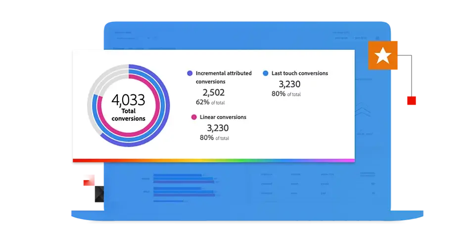
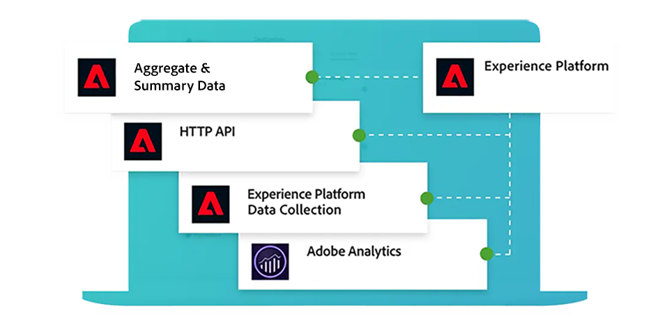
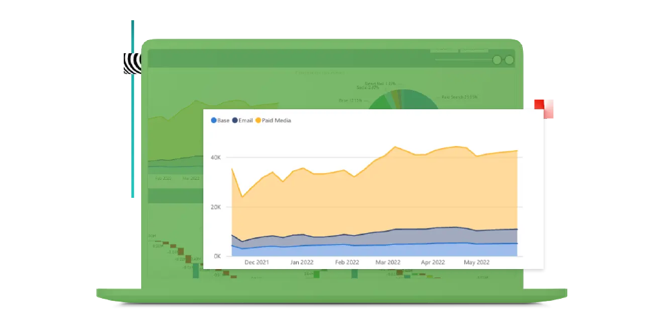
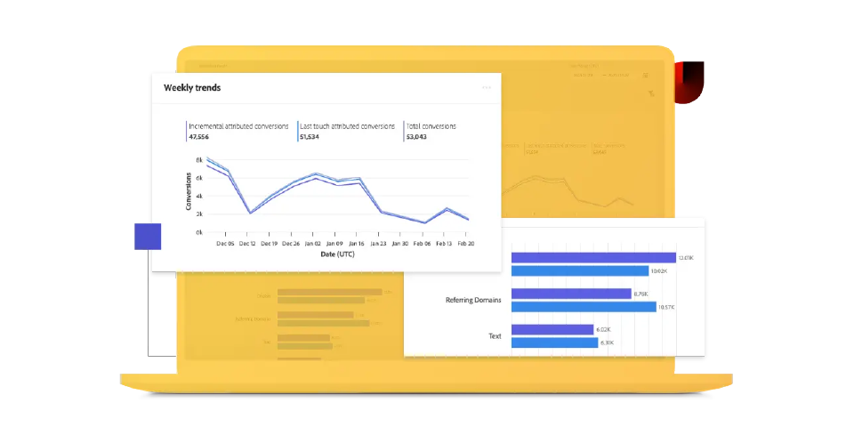

# Adobe Mix Modeler指南

本技術檔案指南提供Adobe **Mix Modeler**&#x200B;的自助協助。 Mix Modeler是一種Adobe Experience Cloud應用程式，可跨所有管道（付費、贏取和擁有）測量行銷活動及最佳化規劃。 Mix Modeler是以Adobe Experience Platform為建置基礎，並由Adobe Sensei提供技術支援。

## 從基礎知識開始

<table style="table-layout:fixed">
  <tr style="border: 0;">
    <td>
    
    
<strong>快速入門</strong> 在Mix Modeler的工作流程中取得和insight的概觀。

    </td>
    <td>
    
    
<strong>擷取資料</strong> 瞭解如何將事件和彙總或摘要資料擷取到Mix Modeler。

    </td>
    <td>
    
    
<strong>協調資料</strong> 瞭解如何將彙總和事件資料同化為一致的資料檢視。 
    

    </td>
    <td>
    
    
<strong>模型與計畫</strong> 訓練您的模型並為其評分，然後為您的行銷計畫使用深入分析。

    </td>
  </tr>
  <tr style="border: 0;">
    <td align="center"></td>
    <td align="center"></td>
    <td align="center"></td>
    <td align="center"></td>
    </tr>
</table>

## 探索檔案

<table style="table-layout:fixed">
  <tr style="border: 0;">
    <td>
       
      <strong>擷取資料</strong> <a href="/help/ingest-data/overview.md">總覽</a> - <a href="/help/ingest-data/schemas.md">結構描述</a> - <a href="/help/ingest-data/datasets.md">資料集</a> 
    </td>
    <td>
       
      <strong>協調資料</strong> <a href="/help/harmonize-data/overview.md">概觀</a> - <a href="/help/harmonize-data/fields.md">欄位</a> - <a href="/help/harmonize-data/dataset-rules.md">資料集規則</a> - <a href="/help/harmonize-data/marketing-touchpoints.md">行銷接觸點</a> - <a href="/help/harmonize-data/conversions.md">轉換</a> - <a href="/help/harmonize-data/usage-report.md">使用情況報告</a>  
    </td>
    <td>
       
      <strong>模型</strong> <a href="/help/models/overview.md">總覽</a> - <a href="/help/models/build.md">建立模型</a> - <a href="/help/models/insights.md">模型深入分析</a> - <a href="/help/models/scoring-data.md">使用評分資料</a>
    </td>
  </tr>
  <tr style="border: 0;">
    <td>
       
      <strong>計畫</strong> <a href="/help/plans/overview.md">計畫</a> - <a href="/help/plans/build.md">建置計畫</a> - <a href="/help/plans/compare.md">比較計畫</a> - <a href="/help/plans/build.md">計畫深入分析</a>
    </td>
    <td>
       
      <strong>總覽</strong> <a href="/help/dashboard/overview.md">結構描述</a> - <a href="/help/dashboard/harmonized-data.md">協調資料</a> - <a href="/help/dashboard/plans.md">計畫</a>
    </td>
        <td>
       
      <strong>教學課程</strong> <a href="https://experienceleague.adobe.com/docs/mix-modeler-learn/tutorials/overview.html?lang=zh-Hant">總覽</a> - <a href="https://experienceleague.adobe.com/docs/mix-modeler-learn/tutorials/intro/use-cases.html?lang=zh-Hant">使用案例</a> - <a href="https://experienceleague.adobe.com/docs/mix-modeler-learn/tutorials/intro/user-workflow.html?lang=zh-Hant">使用者工作流程</a> - <a href="https://experienceleague.adobe.com/docs/mix-modeler-learn/tutorials/intro/user-interface-tour.html?lang=zh-Hant">使用者介面導覽</a>
    </td>
  </tr>
</table>

