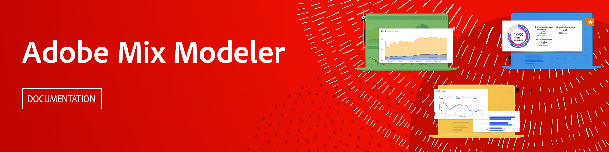

# Adobe組合建模器指南

本技術檔案指南提供 **Adobe組合建模器**. Mix Modeler是一種Adobe Experience Cloud應用程式，可跨所有管道（付費、贏取和擁有）來測量行銷活動及最佳化規劃。 Mix Modeler是以Adobe Experience Platform為基礎建立，並由Adobe Sensei提供技術支援。

>[!AVAILABILITY]
>
>此產品將於2023年下半年推出。 您可在此處找到檔案草稿。

## 開始使用

* 什麼是 [混合模型工具](get-started/about.md)？

* 典型值 [應用程式工作流程](get-started/workflow.md)？

<!--
## Concepts

<table style="table-layout:fixed">
<tr>
    <td valign="top">
        
    

    <a href="/help/ingest-data/datasets.md"><strong>Datasets</strong></a>
    

    <em>Find out the various tools that you can use to troubleshoot your journeys.</em>
     
  </td>
  <td valign="top">
    
    

    <a href="using/usecase/building-the-journey.md"><strong>Use case</strong></a>
    

    <em>Learn how to create an advanced journey step-by-step.</em>
     
  </td>
  <td valign="top">
    
    

    <a href="using/expression/expressionadvanced.md"><strong>Building advanced expressions</strong></a>
    

    <em>Learn how to build complex expressions leveraging data from events and data sources. </em>
     
  </td>
</tr>
</table>
-->
