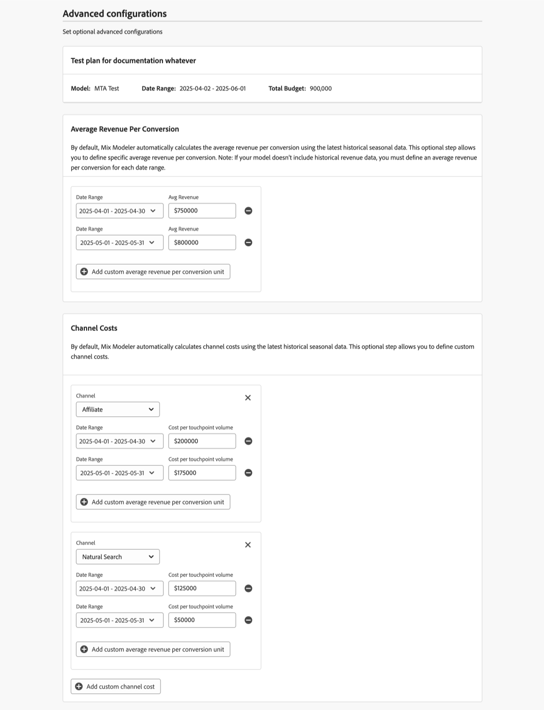

# 建置計畫

在Mix Modeler中，您可以使用計畫畫布建立計畫。 在計畫畫布中，您可以設定計畫的明細與預算，以及計畫要使用的基本模型。 一旦您指定了詳細資訊、預算和模型，您就可以繼續進行AI推薦的計畫或編輯依據管道的支出。

若要建立計畫，請在Mix Modeler的 **[!UICONTROL Plans]**&#x200B;介面中選取&#x200B;**[!UICONTROL Create plan]**。

1. 在&#x200B;**[!UICONTROL Plan creation]**&#x200B;畫面中：

   1. 在&#x200B;**[!UICONTROL Setup]**&#x200B;區段中：

      1. 輸入&#x200B;**[!UICONTROL Plan name]**，例如`Demo plan`。 輸入&#x200B;**[!UICONTROL Description]**，例如`Demo plan for Luma company`。
      1. 從&#x200B;**[!UICONTROL _中選取&#x200B;**[!UICONTROL Model]**選取選項……_.]**
      1. 您可以選取 **[!UICONTROL Create model]**，以直接從計畫建立中建立模型。 這會在您的瀏覽器中開啟新索引標籤，並顯示[模型](../models/overview.md)介面。

         

   1. 在&#x200B;**[!UICONTROL Budget]**&#x200B;區段中：

      1. 透過輸入日期或使用選取日期範圍來指定日期範圍。
      1. 輸入預算。

      若要新增其他日期範圍（每個日期範圍都有預算），請選取 **[!UICONTROL Add row]**。

      若要刪除日期範圍和相關預算，請選取。

      若要定義指定的最大預算，請執行下列步驟：

      1. 切換&#x200B;**[!UICONTROL Maximize budget]**&#x200B;開啟。
      1. 指定最大預算金額。 金額應等於或高於為日期範圍指定的預算總金額。

         

   1. 選擇「**[!UICONTROL Next]**」。

1. 在&#x200B;**[!UICONTROL Done with all required fields]**&#x200B;對話方塊：

   

   * 如果您想要產生具有預測ROI的AI建議計畫，請選取 **[!UICONTROL Create plan now]**。

     選取&#x200B;**[!UICONTROL OK]**。 您的計畫已建立。

   * 如果您要在建立具有預測ROI的計畫之前編輯頻道預算並定義進階設定，請選取 **[!UICONTROL Edit channel budgets first]**。

     選取「**[!UICONTROL OK]**」，以便在下一個步驟中定義您在&#x200B;**[!UICONTROL Spend selection]**&#x200B;中的管道支出。

1. 在&#x200B;**[!UICONTROL Spend selection]**&#x200B;區段中，針對每個預算日期範圍，使用開啟該資料範圍的管道分佈檢視。

   如果您想要使用過去的行銷支出資料和深入分析，可以使用歷史參考資料。 您應將歷史參考資料考量至：

   * 透過強調高績效管道和績效不佳的管道，改善預算分配。
   * 支援趨勢分析。
   * 在設定計畫時，找出有效策略並避免錯誤。

   如果您選取歷史參考期間，則需調整先前的支出模式偏好設定，而Mix Modeler的計畫功能可產生符合您期望的計畫。 這些計畫最終應能增強利害關係人的信心，確保行銷計畫是策略性的、高效的，並且這些計畫以證實的效能資料和業務需求為基礎。

   

   1. 選取 **[!UICONTROL Spend pattern]**。

      * 預設值為&#x200B;**[!UICONTROL Automatic]**。
      * 選取「**[!UICONTROL Historical reference]**」並輸入&#x200B;**[!UICONTROL Start date]**，以參照已可供Mix Modeler使用的過去行銷支出資料。 **[!UICONTROL End date]**&#x200B;是根據您定義支出模式的資料範圍自動決定。 建議的開始日期是第一個可用的過去行銷支出資料。 若要表示您選取了不存在或無效的歷史參考期，您會看到。

   1. 若要定義每個管道的預算，請輸入&#x200B;**[!UICONTROL Min]**&#x200B;和&#x200B;**[!UICONTROL Max]**&#x200B;的值，或使用滑桿。

   1. 若要在貨幣或百分比輸入之間切換，請為&#x200B;**[!UICONTROL View spend by]**&#x200B;選取&#x200B;**[!UICONTROL $]**&#x200B;或&#x200B;**[!UICONTROL %]**。

   1. 完成後，選取&#x200B;**[!UICONTROL Create]**。
      

   1. 選擇「**[!UICONTROL Next]**」。

1. 您可以在&#x200B;**[!UICONTROL Advanced configurations]**&#x200B;區段中輸入選用的進階組態。

   

   * 您的計畫名稱、模型、日期範圍和總預算已彙總起來。

   * 依預設，Mix Modeler會使用最新的歷史季節性資料，自動計算每次轉換的平均收入。 在&#x200B;**[!UICONTROL Average Revenue per conversion]**&#x200B;中，您可以定義每次轉換的特定平均收入。

      1. 針對預算中的每個日期範圍：

         1. 從&#x200B;**[!UICONTROL Date range]**&#x200B;下拉式功能表中選取日期範圍。
         1. 輸入&#x200B;**[!UICONTROL Average revenue]**&#x200B;值。

      1. 選取「新增每個轉換單位的自訂平均收入」以新增日期範圍。
      1. 選取以移除日期範圍。

     >[!NOTE]
     >
     >如果您的模型不包含歷史收入資料，則必須針對您為預算指定的每個日期範圍，定義每次轉換的平均收入。
     >

   * 依預設，Mix Modeler會使用最新的歷史季節性資料自動計算管道成本。 在&#x200B;**[!UICONTROL Channel costs]**&#x200B;中，您可以定義自訂管道成本。

      1. 針對模型中的各個管道，定義自訂管道成本。

         1. 從&#x200B;**[!UICONTROL Channel]**&#x200B;下拉式選單中選取頻道。
         1. 針對預算中的每個日期範圍：
            1. 從&#x200B;**[!UICONTROL Date range]**&#x200B;下拉式功能表中選取日期範圍。
            1. 輸入&#x200B;**[!UICONTROL Average revenue]**&#x200B;值。
         1. 選取 **[!UICONTROL Add custom average revenue per conversion unit]**&#x200B;以新增日期範圍。
         1. 選取以移除日期範圍。

      1. 選取 **[!UICONTROL Add custom channel cost]**&#x200B;以新增頻道。
      1. 選取以移除自訂頻道。

   1. 完成後，選取&#x200B;**[!UICONTROL Create]**。

   1. 在&#x200B;**[!UICONTROL Create plan]**&#x200B;對話方塊中，選取&#x200B;**[!UICONTROL Create plan]**&#x200B;以建立計畫。 選取&#x200B;**[!UICONTROL Cancel]**&#x200B;以取消計畫的建立。 顯示&#x200B;**[!UICONTROL No work is saved]**&#x200B;對話方塊以進行確認。

