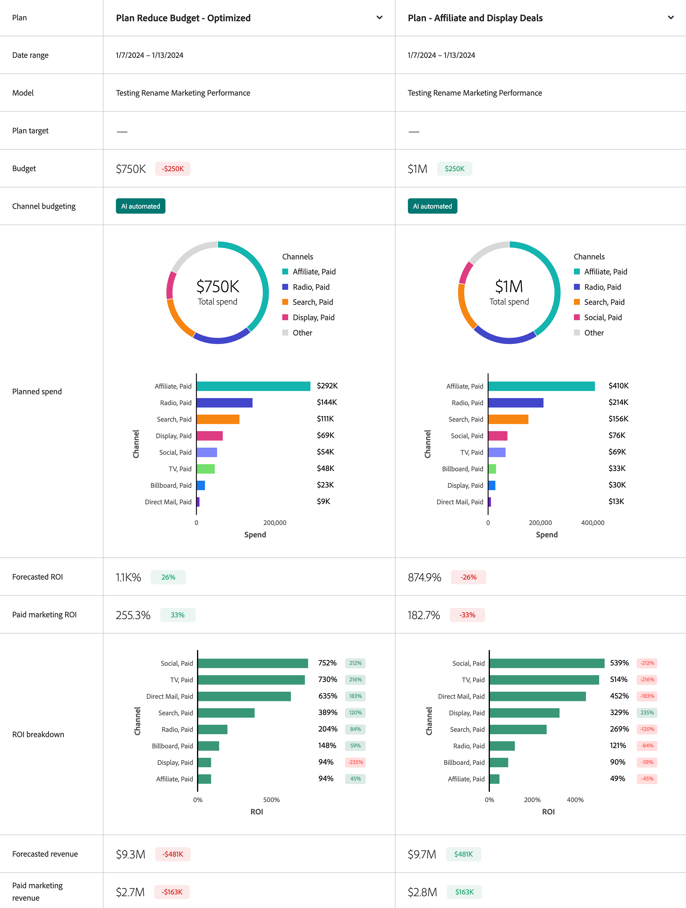

# 比較計畫

若要比較「Mix Modeler計畫」介面中的計畫：

* 選取  **[!UICONTROL Compare Plans]**. 在比較計畫中，為每個計畫選取一個計畫 **[!UICONTROL _選取計畫_]**.

* 或者，您可以從「計畫」表格中選取兩個計畫，然後從作業列選取  **[!UICONTROL Compare]**.

「比較計畫」介面會顯示下列資訊和Widget：

* 計畫
* 日期範圍
* 模型
* 預算
* 混合型別
* 支出細目
* 預測的投資報酬率
* ROI劃分
* 預測回訪

您可以將滑鼠停留在每個Widget中的個別圖表元素上，以檢視包含更多詳細資訊的彈出視窗。

選取 **[!UICONTROL Close]** 以返回「計畫」概要。
