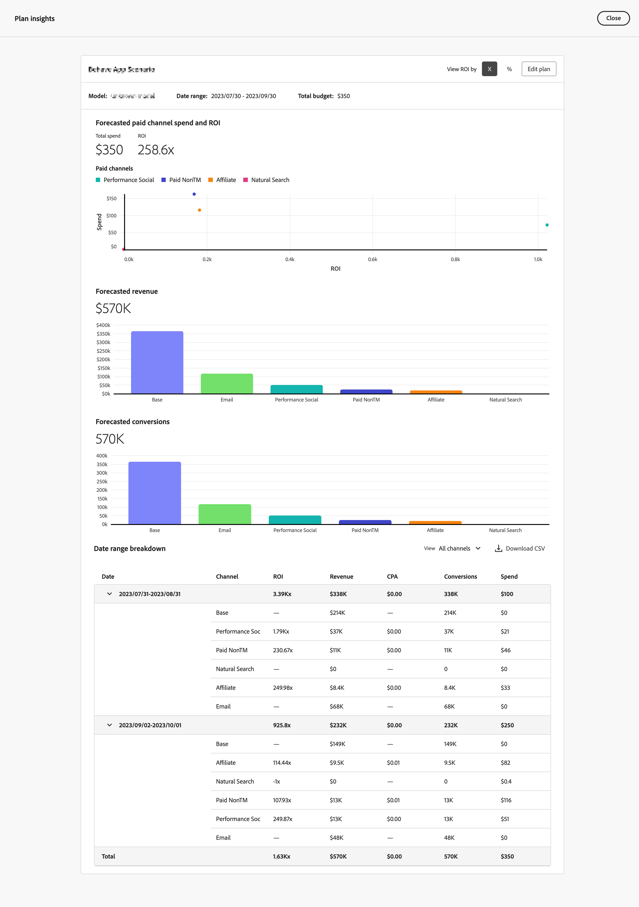
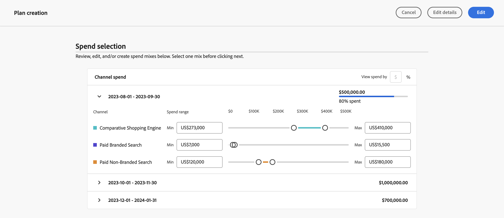
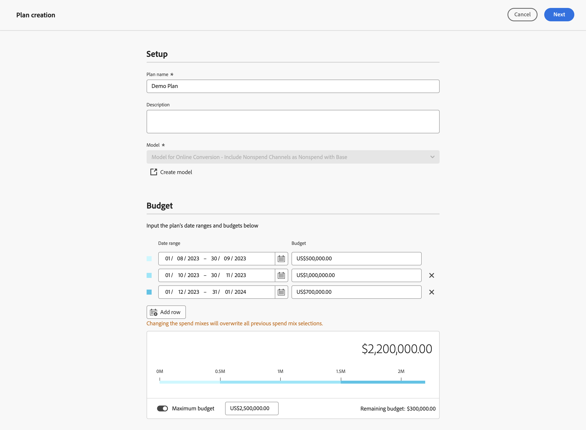

# 編輯計畫

若要編輯計畫，請在  **[!UICONTROL Plans]** 介面在Mix Modeler中，依名稱選取您的計畫。

在 [!UICONTROL Plan insights]，即會建立您的計畫深入分析，並顯示 [!UICONTROL Model]，則 [!UICONTROL Data range]、和 [!UICONTROL Total budget] 計畫所根據的。

擷取完成後，您會看到計畫的概觀，其中包含視覺效果 [!UICONTROL Forecasted ROI] 和 [!UICONTROL Forecasted revenue].

1. 選取 **[!UICONTROL Close]** 以返回「計畫」介面。

1. （選擇性）選取 **[!UICONTROL Plan breakdown]** 以檢視計畫的劃分表。

   

1. 若要編輯計畫，請選取 **[!UICONTROL Edit plan]**：

   1. 在 **[!UICONTROL Spend selection]** 區段，針對每個預算日期範圍，使用  以開啟該資料範圍的管道分佈檢視。

   1. 若要修改每個管道的預算，請修改 **[!UICONTROL Min]** 和 **[!UICONTROL Max]** 或使用滑桿。

   1. 若要在貨幣或百分比輸入之間切換，請選取 **[!UICONTROL $]** 或 **[!UICONTROL %]** 的 **[!UICONTROL View spend by]**.

      

   1. 若要編輯計畫的詳細資訊，請選取 **[!UICONTROL Edit details]**：

      1. 在 **[!UICONTROL Setup]** 區段（如果適用）修改 **[!UICONTROL Plan name]** 和 **[!UICONTROL Description]**.

      1. 在 **[!UICONTROL Budget]** 區段：

         1. 修改 **[!UICONTROL Date range]** 輸入日期或使用選取日期範圍，以取得一或多個計畫的日期範圍 .

         1. 修改 **[!UICONTROL Budget]** 您計畫的一或多個日期範圍。

         若要新增其他日期範圍（每個日期範圍都有預算），請選取「 」  **[!UICONTROL Add row]**.

         若要刪除日期範圍與相關的預算，請選取 .

         若要定義最大預算，請執行下列步驟：

         1. 切換 **[!UICONTROL Maximize budget]** 開啟。
         1. 指定最大預算金額。 金額應等於或高於為日期範圍指定的預算總金額。

      1. 選取 **[!UICONTROL Next]** 以返回 **[!UICONTROL Spend]** 區段。 選取 **[!UICONTROL Cancel]** 以返回您的計畫總覽。

         

1. 完成計畫編輯後，選取 **[!UICONTROL Edit]**.

   在 **[!UICONTROL All changes are final]** 對話方塊，選取 **[!UICONTROL OK]** 更新計畫的目前支出配置與ROI與收入預測。 選取 **[!UICONTROL Cancel]** 以取消計畫的更新。

1. 若要取消計畫更新，請選取 **[!UICONTROL Cancel]**.

   在 **[!UICONTROL No work will be saved]** 對話方塊，選取 **[!UICONTROL Cancel]** 以繼續處理您的計畫或選取 **[!UICONTROL OK]** 返回「計畫」介面。

