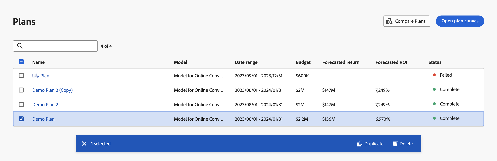

# 計畫

Mix Modeler中的計畫可讓您依業務單位和管道分配預算。 計畫功能會根據您協調的資料與已訓練模型的結果整合。

## 檢視計畫

若要檢視目前計畫的表格，請在Mix Modeler介面中：

1. 選取  **[!UICONTROL Plans]** 從左側邊欄。

1. 您會看到目前計畫及其狀態的表格。

   表格資料欄會指定計畫的詳細資訊。

   | 欄名稱 | 詳細資料 |
   |---|---|
   | 名稱 | 計畫名稱 |
   | 說明 | 模型說明 |
   | 模型 | 作為計畫基礎的模型。 |
   | 日期範圍 | 計畫的完整日期範圍。 |
   | 預算 | 計畫的總預算。 |
   | 預測回訪 | 計畫的預測傳回 |
   | 預測的投資報酬率 | 計畫的預測ROI。 |
   | 狀態 | 計畫的狀態。 |

   {style="table-layout:auto"}

1. 使用  搜尋和篩選一或多個特定計畫的表格。

## 選擇計畫並對計畫採取行動

您可以選取一或多個計畫，這會顯示「計畫」動作列。 動作列可讓您刪除、比較或複製計畫。

若要移除「計畫」表格中的所有選取專案，請選取  在動作列中

### 複製計畫

若要複製計畫，請執行下列步驟：

1. 從表格中選取單一計畫。
1. 選取  **[!UICONTROL Duplicate]** 從動作列移除。 新計畫，其名稱由附加原始計畫名稱所組成 **[!UICONTROL (Copy)]**，即會新增至表格頂端。

### 比較計畫

若要比較計畫：

1. 從表格中選取兩個計畫。
1. 選取  **[!UICONTROL Compare]** 從動作列移除。 您會看到 **[!UICONTROL Compare plans]** UI。

### 刪除計畫

若要刪除計畫，請執行下列動作：

1. 從表格中選取一或多個計畫。
1. 選取  **[!UICONTROL Delete]** 從動作列移除。

   >[!WARNING]
   >
   >   立即刪除選取的計畫！